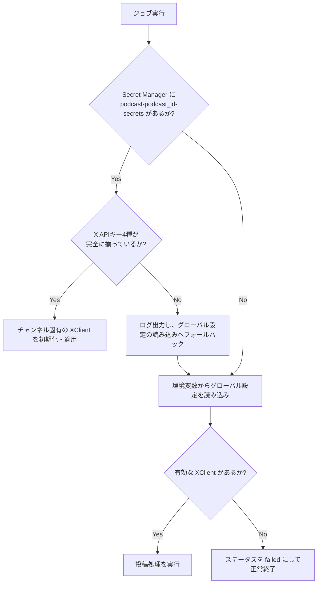

# チャンネル別認証情報（Credentials）管理マニュアル

本マニュアルは、ポッドキャスト（チャンネル）ごとに独立した X (Twitter) API および Discord Bot トークンをセキュアに取得・適用するための仕様、現状の課題、および代替案について整理したものです。

---

## 1. 現行の基本仕様 (Specifications)

マルチチャンネル運用において、各チャンネル専用の認証情報を動的に解決する仕組みの仕様です。

### 1-1. 保存場所と命名規則
* **システム**: Google Cloud Secret Manager
* **シークレット名**: `podcast-{podcast_id}-secrets`
  * 例: ポッドキャストIDが `1` の場合、シークレット名は `podcast-1-secrets` となります。
* **データ形式**: JSON

### 1-2. JSON ペイロード構造 (スキーマ)
キー名は、従来の接頭辞（`x_` 等）の有無にかかわらず、以下のいずれの名前でも柔軟にパースされます。

```json
{
  "x_api_key": "YOUR_X_API_KEY",                // または "api_key"
  "x_api_secret": "YOUR_X_API_SECRET",            // または "api_secret"
  "x_access_token": "YOUR_X_ACCESS_TOKEN",        // または "access_token"
  "x_access_token_secret": "YOUR_X_ACCESS_TOKEN_SECRET", // または "access_token_secret"
  "discord_bot_token": "YOUR_DISCORD_BOT_TOKEN"
}
```

### 1-3. 取得・評価の優先順位（ダブル・フォールバック）
システムは実行時、以下の優先順位に従って動的に認証情報を解決します。



1. **第1優先 (Channel-Specific)**: `podcast-{podcast_id}-secrets` から読み込まれた値。
   * X API キーは4種 (`x_api_key`, `x_api_secret`, `x_access_token`, `x_access_token_secret`) がすべて存在する場合のみ適用されます。
   * 一部でも欠損している場合は、ログに通知された上でグローバル設定へフォールバックします。
2. **第2優先 (Global Fallback)**: コンテナ起動時の環境変数（`X_API_KEY`, `DISCORD_BOT_TOKEN` 等）。
3. **例外時の安全設計**:
   * Secret Manager に対象ポッドキャストのシークレット自体が存在しない場合、警告ログを出力しつつ、グローバルフォールバックを用いて処理を続行します。
   * 認証情報が最終的に解決できない場合は、エラーでプロセスを異常クラッシュさせず、対象ドキュメントのステータスを Firestore 上で `failed` にマークして安全に終了します。

---

## 2. 現行仕様における課題とリスク (Challenges)

### 2-1. バリデーション緩和に伴う「意図しないフォールバック」のリスク
* **課題**: 現在の仕様では、JSON 内のキー名に誤字（例: `x_api_kay`）があったり、キーが一部欠損していたりしても、Secret Manager のロード処理は例外を発生させず `None` として処理を通過させます。
* **リスク**: 本来はチャンネル固有のアカウントに投稿するつもりが、設定ミスにより**無言でグローバル（共通）アカウントへの投稿にフォールバックしてしまい、誤投稿を引き起こすリスク**があります。

### 2-2. Secret Manager の API コストとクォータ
* **課題**: 毎回の自動投稿チェックやリマインダー実行時に毎回 Secret Manager API を呼び出します。
* **リスク**: チャンネル数や実行頻度（cron の間隔）が増加するにつれて、Secret Manager の API 呼び出しコスト（GCP課金）および API レートリミット（クォータ）の制約に達する可能性があります。

### 2-3. インフラ運用のオーバーヘッド
* **課題**: ポッドキャストの新規追加時に、GCPコンソールやTerraform等から手動で Secret Manager リソースを作成する必要があります。
* **リスク**: 現状、Web UI からはシークレット情報の登録ができないため、管理者の作業工数が発生し、プロビジョニングの遅延に繋がります。

---

## 3. 代替案および今後の改善案 (Alternatives)

### 代替案 A: 厳格なスキーマ検証の再導入（推奨）
* **アプローチ**: 「シークレットが存在するが内容が不正な場合」と「シークレット自体が存在しない場合」を明確に区別します。
  * **実装方法**: シークレットを取得できた場合、部分的な欠損があればフォールバックせず明示的にエラー（`ValueError`）をスローし、そのチャンネルの処理を即座に安全停止させます。これにより、誤ったアカウント（フォールバック先）への誤投稿を確実に防ぎます。

### 代替案 B: Firestore への暗号化保存（Web UI 連携向け）
* **アプローチ**: 認証情報を Secret Manager ではなく、Firestore の `podcasts/{podcast_id}` ドキュメント内に暗号化フィールドとして格納します。
  * **暗号化手法**: GCP KMS (Key Management Service) を用いてデータをエンベロープ暗号化した上で Firestore に保存します。
  * **メリット**: Web UI 側から Firestore を経由して動的に認証情報を登録・編集できるようになるため、GCPインフラ管理者の手動作業が完全に不要になります。

### 代替案 C: 単一の JSON マッピングシークレットの運用
* **アプローチ**: チャンネルごとに Secret Manager のリソースを分けるのではなく、単一のシークレット（例: `podcast-channels-secrets`）の中に、以下のような全チャンネルのマッピング構造を持たせます。
  ```json
  {
    "channel_a": { "x_api_key": "...", ... },
    "channel_b": { "x_api_key": "...", ... }
  }
  ```
  * **メリット**: GCP 上の Secret Manager のリソース数が 1 つで済むため、API 呼び出しの集約や IAM 権限の管理が極めてシンプルになります。
  * **デメリット**: 1つのチャンネルの設定を更新する際にシークレット全体を書き換える必要があるため、他のチャンネルの設定を誤って上書き・破損してしまうオペレーションミスが発生しやすくなります。
