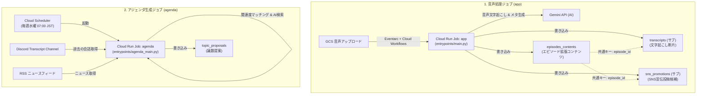

# Firestore 生成コンテンツ仕様書 (Firestore Spec)

本ドキュメントは、**podcast-automator** において Cloud Run ジョブによって生成され、Firestore に格納されるコンテンツの物理スキーマ、生成元サービス、およびトリガー仕様を定義します。

---

## 1. 全体アーキテクチャとデータフロー

システムには Firestore にデータを書き込む **2つの Cloud Run ジョブ** が存在します。



---

## 2. ジョブと生成コンテンツ一覧

| No | 書き込み先 Firestore パス | ドキュメント種別 | 生成元サービス (Cloud Run Job 名) | トリガー契機 |
|:---|:---|:---|:---|:---|
| 1 | `podcasts/{podcast_id}/episodes_contents/{episode_id}` | 親ドキュメント | `${var.system}-app-${var.environment}` | GCSバケットへの音声アップロード完了（Eventarc → Workflows 経由） |
| 2 | `podcasts/{podcast_id}/episodes_contents/{episode_id}/transcripts/{chunk_id}` | サブコレクション | `${var.system}-app-${var.environment}` | 同上 |
| 3 | `podcasts/{podcast_id}/episodes_contents/{episode_id}/sns_promotions/{promotion_id}` | サブコレクション | `${var.system}-app-${var.environment}` | 同上 |
| 4 | `podcasts/{podcast_id}/topic_proposals/{proposal_id}` | コレクション（トップレベル） | `${var.system}-agenda-${var.environment}` | Cloud Scheduler による毎週水曜日 07:00 JST の定期実行 |

---

## 3. 各ドキュメント仕様詳細

### 3.1 エピソード拡張コンテンツ (episodes_contents)
エピソードごとの文字起こし要約、AI生成の番組タイトル/概要、および配信音声メタデータを保持する親ドキュメント。

- **Firestore パス**: `podcasts/{podcast_id}/episodes_contents/{episode_id}`
- **生成ジョブ**: `podcast-automator-app-{environment}` (`app/src/entrypoints/main.py`)
- **ドキュメントID (`{episode_id}`)**: 新規生成された UUID (32文字の hex 文字列)

#### スキーマ定義
| フィールド名 | データ型 | 説明 |
|:---|:---|:---|
| `episode_id` | `string` | ドキュメント ID と同一の UUID |
| `episode_number` | `number` | エピソード番号 (RSSフィードに登録されている総エピソード数 + 1) |
| `updated_at` | `string (ISO 8601)` | 生成/更新時の UTC タイムスタンプ (例: `2026-06-22T06:30:00Z`) |
| `transcript_summary` | `string` | Gemini により生成された音声の要約 (文字起こし全体の要約) |
| `ai_generated_meta` | `map` | AIが推薦したメタ情報 |
| ├ `title` | `string` | Gemini が提案したエピソードタイトル (例: `"#15 [タイトル]"`) |
| ├ `description` | `string` | Gemini が提案したエピソード説明文 |
| ├ `prompt_version` | `string` | プロンプトのバージョン管理用識別子 (固定値 `"v1"`) |
| └ `generated_at` | `string (ISO 8601)` | メタ情報が生成された UTC タイムスタンプ |
| `show_notes_summary` | `map` | ショーノート(番組詳細)向けの構成情報 |
| ├ `overview` | `string` | エピソードの概要 (通常 `transcript_summary` と同一) |
| └ `topics` | `array [map]` | トピック一覧 (現行では開始時の1アイテム) |
| 　 ├ `time` | `string` | 開始時間 (固定値 `"00:00"`) |
| 　 └ `title` | `string` | トピックタイトル (エピソードタイトルと同一) |
| `audio_metadata` | `map` | 配信音声の物理情報 |
| ├ `file_size_bytes` | `number` | 変換後 MP3 ファイルのサイズ (バイト) |
| ├ `duration_str` | `string` | 音声の再生時間 (フォーマット: `HH:MM:SS`) |
| ├ `audio_url` | `string` | Cloudflare R2 カスタムドメイン経由の配信 URL |
| └ `mime_type` | `string` | 音声の MIME タイプ (固定値 `"audio/mpeg"`) |

#### ペイロード例
```json
{
  "episode_id": "4a7b2c9d8e1f0a3b5c7d9e1f2a3b4c5d",
  "episode_number": 15,
  "updated_at": "2026-06-22T06:30:00.123456Z",
  "transcript_summary": "今回のエピソードでは、GCPのCloud Run JobとFirestoreを用いたサーバーレスなバッチ処理システムについて議論しています。",
  "ai_generated_meta": {
    "title": "#15 Cloud Run JobとFirestoreで作る自動文字起こしパイプライン",
    "description": "音声ファイルをアップロードするだけで、自動で音声変換・文字起こし・RSS更新・Firestore格納・Discord通知を行う構成について紹介します。",
    "prompt_version": "v1",
    "generated_at": "2026-06-22T06:30:00.123456Z"
  },
  "show_notes_summary": {
    "overview": "音声ファイルをアップロードするだけで、自動で音声変換・文字起こし・RSS更新・Firestore格納・Discord通知を行う構成について紹介します。",
    "topics": [
      {
        "time": "00:00",
        "title": "#15 Cloud Run JobとFirestoreで作る自動文字起こしパイプライン"
      }
    ]
  },
  "audio_metadata": {
    "file_size_bytes": 12582912,
    "duration_str": "00:15:30",
    "audio_url": "https://podcast.sunabalog.com/ep/15/audio.mp3",
    "mime_type": "audio/mpeg"
  }
}
```

---

### 3.2 文字起こし断片 (transcripts)
音声からテキスト変換した文字起こし全文を、Firestore のドキュメントサイズ制限 (1MB) や読み込み効率を考慮し、段落 (`\n\n`) の区切りを意識しつつ最大 1200 文字ごとに分割して保存するサブコレクション。

- **Firestore パス**: `podcasts/{podcast_id}/episodes_contents/{episode_id}/transcripts/{chunk_id}`
- **生成ジョブ**: `podcast-automator-app-{environment}` (`app/src/entrypoints/main.py`)
- **ドキュメントID (`{chunk_id}`)**: `chunk_0001`, `chunk_0002` のような連番フォーマット (`chunk_{index:04d}`)

#### スキーマ定義
| フィールド名 | データ型 | 説明 |
|:---|:---|:---|
| `chunk_id` | `string` | ドキュメント ID と同一の連番文字列 |
| `start_time` | `number` | 再生開始時間（秒）。現状はプレースホルダーとして `0` が入る |
| `end_time` | `number` | 再生終了時間（秒）。現状はプレースホルダーとして `0` が入る |
| `speaker` | `string` | 発話者名。現状はプレースホルダーとして `"unknown"` が入る |
| `text` | `string` | 分割された文字起こしテキスト本文 (最大 1200 文字) |

#### ペイロード例
```json
{
  "chunk_id": "chunk_0001",
  "start_time": 0,
  "end_time": 0,
  "speaker": "unknown",
  "text": "こんにちは。ポッドキャスト「すなばろぐ」の第15回目です。今回はGoogle Cloudで動く、私たちのポッドキャスト自動化ツールについて詳しくお話しします。\n\nこれまで手動でやっていた音声編集やRSSフィードの記述が、どのような仕組みで自動化されたのかをまとめました。"
}
```

---

### 3.3 SNS宣伝用投稿文 (sns_promotions)
エピソード公開時に、X (旧Twitter) などのSNSへ自動投稿するためのメッセージ案とスケジューリング情報を保持するサブコレクション。

- **Firestore パス**: `podcasts/{podcast_id}/episodes_contents/{episode_id}/sns_promotions/{promotion_id}`
- **生成ジョブ**: `podcast-automator-app-{environment}` (`app/src/entrypoints/main.py`)
- **ドキュメントID (`{promotion_id}`)**: 新規生成された UUID (32文字の hex 文字列)

#### スキーマ定義
| フィールド名 | データ型 | 説明 |
|:---|:---|:---|
| `status` | `string` | 投稿ステータス。生成時は `"pending"` (未投稿) に設定される |
| `generated_at` | `string (ISO 8601)` | 生成された UTC タイムスタンプ |
| `scheduled_time` | `string (ISO 8601)` | 投稿予定日時。環境変数 `SNS_SCHEDULE_OFFSET_HOURS` に従い、生成時から一定時間後（デフォルト 1 時間後）に設定される |
| `episode` | `map` | 対象エピソードの簡略情報 |
| └ `number` | `number` | エピソード番号 |
| `message` | `string` | 投稿用メッセージの本文 (例: `新しいエピソード: [タイトル]\n[音声URL]`) |
| `platform_urls` | `map` | 各ポッドキャスト配信プラットフォームへのURL (生成時は空文字プレースホルダー) |
| ├ `apple` | `string` | Apple Podcasts の配信 URL (初期値: `""`) |
| ├ `spotify` | `string` | Spotify の配信 URL (初期値: `""`) |
| └ `amazon` | `string` | Amazon Music の配信 URL (初期値: `""`) |
| `hashtags` | `array [string]` | 投稿用ハッシュタグの一覧 (デフォルト: `["#Podcast"]`) |

#### ペイロード例
```json
{
  "status": "pending",
  "generated_at": "2026-06-22T06:30:00.123456Z",
  "scheduled_time": "2026-06-22T07:30:00.123456Z",
  "episode": {
    "number": 15
  },
  "message": "新しいエピソード: #15 Cloud Run JobとFirestoreで作る自動文字起こしパイプライン\nhttps://podcast.sunabalog.com/ep/15/audio.mp3",
  "platform_urls": {
    "apple": "",
    "spotify": "",
    "amazon": ""
  },
  "hashtags": [
    "#Podcast"
  ]
}
```

---

### 3.4 次回収録向けの議題提案 (topic_proposals)
過去の Discord での音声文字起こし履歴と、RSSフィードから収集した最新テックニュースを照らし合わせ、次回収録のテーマや論点をAIが提案するアジェンダ情報。

- **Firestore パス**: `podcasts/{podcast_id}/topic_proposals/{proposal_id}`
- **生成ジョブ**: `podcast-automator-agenda-{environment}` (`app/src/entrypoints/agenda_main.py`)
- **ドキュメントID (`{proposal_id}`)**: 新規生成された UUID (32文字の hex 文字列)

#### スキーマ定義
| フィールド名 | データ型 | 説明 |
|:---|:---|:---|
| `proposal_id` | `string` | ドキュメント ID と同一の UUID |
| `target_period_string` | `string` | 提案の対象となるカレンダー週 (例: `"2026年 第26週 (06/22 - 06/28)"`) |
| `generated_at` | `string (ISO 8601)` | アジェンダが生成された UTC タイムスタンプ |
| `related_news` | `array [map]` | 直近のテックニュースからマッチした上位3件のニュース |
| ├ `title` | `string` | ニュース記事のタイトル |
| ├ `url` | `string` | ニュース記事のリンク URL |
| ├ `summary` | `string` | ニュース記事の要約 |
| └ `source_reason` | `string` | 議題テーマとの関連度合い（スコア）と理由 |
| `suggested_topics` | `array [map]` | 次回収録で深掘りすべきと判断されたテーマ案（上位3件） |
| ├ `title` | `string` | テーマ名 |
| ├ `description` | `string` | 次回のトーク概要 (フォーマット: `"[テーマ名] について次回深掘りする。"`) |
| ├ `suggested_points` | `array [string]` | トークの論点や関連発言の証跡 (Discord文字起こしから抽出された最大3つの発言テキスト) |
| └ `related_past_episodes` | `array [number]` | このテーマに関連する過去のエピソード番号の一覧 (重複排除かつソート済み) |

#### ペイロード例
```json
{
  "proposal_id": "e9f8d7c6b5a493827160eeddccbbaa99",
  "target_period_string": "2026年 第26週 (06/22 - 06/28)",
  "generated_at": "2026-06-22T07:00:00.123456Z",
  "related_news": [
    {
      "title": "Google Cloud が Firestore の新しいクエリ機能を発表",
      "url": "https://example.com/news/firestore-new-query",
      "summary": "Firestore で OR クエリや高度なベクトル検索が容易になり、検索性能が大幅に向上...",
      "source_reason": "Firestore設計 との関連度 0.85"
    }
  ],
  "suggested_topics": [
    {
      "title": "Firestore設計",
      "description": "Firestore設計 について次回深掘りする。",
      "suggested_points": [
        "文字起こしデータを格納するときはチャンクに分割した方がいいよねという話",
        "サブコレクションを使うべきかトップレベルコレクションにするべきか"
      ],
      "related_past_episodes": [
        5,
        8
      ]
    }
  ]
}
```
