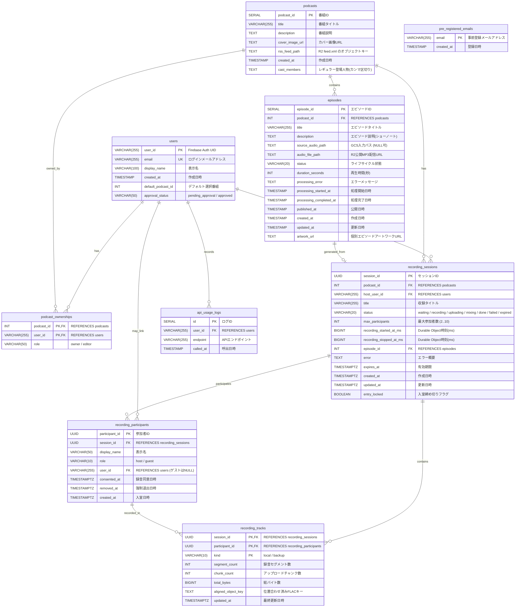
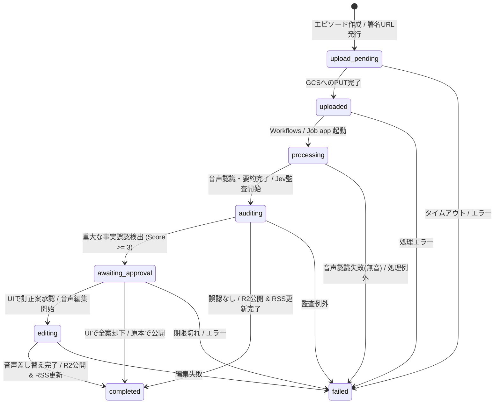

# SparkCast データベース・ストレージスキーマ仕様

本ドキュメントでは、SparkCast におけるデータ永続化層（PostgreSQL、Firestore、GCS、Cloudflare R2）の物理・論理スキーマ、ER図、ドキュメント構造、およびストレージライフサイクルについて解説します。

> [!NOTE]
> 関連ドキュメント：
> - [システムアーキテクチャ全体像](file:///Users/onotakayoshi/Documents/Projects/sunabalog/SparkCast/sparkcast/docs/system_architecture.md)
> - [処理パイプライン詳細](file:///Users/onotakayoshi/Documents/Projects/sunabalog/SparkCast/sparkcast/docs/processing_pipelines.md)
> - [サービスコンセプト・アピールポイント・AIエージェント](file:///Users/onotakayoshi/Documents/Projects/sunabalog/SparkCast/sparkcast/docs/service_concept.md)

---

## 1. ハイブリッドデータ設計思想

SparkCast では、データの特性・整合性要件・アクセスパターンに応じて、**PostgreSQL（Cloud SQL / Supabase）** と **Google Cloud Firestore（NoSQL）**、および **オブジェクトストレージ（GCS / Cloudflare R2）** を組み合わせたハイブリッド構成を採用しています。

| ストア種別 | 対象データ | 選定理由・特徴 |
|:---|:---|:---|
| **PostgreSQL**<br>(Cloud SQL / Supabase) | ユーザー、ポッドキャスト番組、権限、エピソード基本情報、ブラウザ収録セッション・参加者・トラック集計。 | ACIDトランザクション、外部キー制約、厳密な正規化、リレーショナル集計が必要な基幹マスタ。 |
| **Firestore (NoSQL)** | エピソード拡張メタ、話者・時刻付き文字起こし断片、AIディレクター介入提案、SNS投稿案、次回アジェンダ、RAGベクトルインデックス。 | 1エピソードあたり数百件に上る発話断片の柔軟な保存、スキーマレスなAI生成メタデータ、KNNベクトル検索（768次元）のサポート。 |
| **Google Cloud Storage (GCS)** | 音声の初期アップロード（Input Bucket）、音声認識用の一時作業領域（Work Bucket）。 | ブラウザ直接PUT用の署名付きURL（V4）、Eventarc によるイベント駆動トリガー、短期間での自動削除ライフサイクル。 |
| **Cloudflare R2** | 配信音声（MP3）、RSSフィード（`feed.xml`）、ブラウザ収録の録音WebMチャンク。 | S3互換API、エグレス転送量完全無料（ポッドキャスト配信コストを極小化）、カスタムドメイン配信。 |

---

## 2. PostgreSQL 物理テーブル定義

### 2.1 ER図 (Entity-Relationship Diagram)



### 2.2 テーブル詳細仕様

#### 1. `users` (ユーザーマスタ)
Firebase Authentication で認証されたユーザー情報を管理。
- `user_id` (VARCHAR(255), PK): Firebase Auth UID。
- `email` (VARCHAR(255), UNIQUE, NOT NULL): ログインメールアドレス。
- `display_name` (VARCHAR(100), NULL): 表示名。
- `created_at` (TIMESTAMP, NOT NULL, DEFAULT now()): 作成日時。
- `default_podcast_id` (INT, NULL): 最後に選択していたポッドキャストID。
- `approval_status` (VARCHAR(50), NOT NULL, DEFAULT 'pending_approval'): `'pending_approval'`, `'approved'`。管理者が許可するまで AI チャット機能等は制限されます。

#### 2. `podcasts` (ポッドキャスト番組マスタ)
配信番組の基本メタデータ。
- `podcast_id` (SERIAL, PK): 番組ID。
- `title` (VARCHAR(255), NOT NULL): 番組タイトル。
- `description` (TEXT, NULL): 番組概要。
- `cover_image_url` (TEXT, NULL): カバーアートURL。
- `rss_feed_path` (TEXT, NULL): R2 配信用 `feed.xml` のキー（例: `podcasts/1/feed.xml`）。
- `created_at` (TIMESTAMP, NOT NULL, DEFAULT now()): 作成日時。
- `cast_members` (TEXT, NULL): レギュラー登場人物名（読点・カンマ区切り）。文字起こしの話者推定（Speech / Gemini）に注入されます。

#### 3. `podcast_ownerships` (番組権限マスタ)
ユーザーと番組の編集・閲覧権限の紐付け（多対多）。
- `podcast_id` (INT, PK, FK -> `podcasts.podcast_id`): 番組ID。
- `user_id` (VARCHAR(255), PK, FK -> `users.user_id`): ユーザーID。
- `role` (VARCHAR(50), NOT NULL): ロール（`"owner"`, `"editor"`）。

#### 4. `episodes` (エピソードマスタ)
エピソードの基本データおよびパイプライン処理ステータス。
- `episode_id` (SERIAL, PK): エピソードID。
- `podcast_id` (INT, NOT NULL, FK -> `podcasts.podcast_id`): 所属番組ID。
- `title` (VARCHAR(255), NOT NULL): エピソードタイトル（初期値からAI要約タイトルへ更新）。
- `description` (TEXT, NULL): ショーノート概要。
- `source_audio_path` (TEXT, NULL): GCS 入力バケットのパス（ブラウザ直接アップロード時）。
- `audio_file_path` (TEXT, NULL): 処理完了後の Cloudflare R2 公開配信URL。
- `status` (VARCHAR(20), NOT NULL): ライフサイクル状態（後述のステータス遷移参照）。
  - 許容値: `upload_pending`, `uploaded`, `processing`, `auditing`, `awaiting_approval`, `editing`, `completed`, `failed`。
- `duration_seconds` (INT, NULL): 再生時間（秒）。
- `processing_error` (TEXT, NULL): 失敗時の例外メッセージ。
- `processing_started_at` (TIMESTAMP, NULL): バッチ処理開始日時。
- `processing_completed_at` (TIMESTAMP, NULL): バッチ処理終了日時。
- `published_at` (TIMESTAMP, NULL): 公開日時。
- `created_at` (TIMESTAMP, NOT NULL, DEFAULT now()): 作成日時。
- `updated_at` (TIMESTAMP, NOT NULL, DEFAULT now()): 更新日時。
- `artwork_url` (TEXT, NULL): エピソード個別のアートワークURL。

#### 5. `api_usage_logs` (API利用ログ)
レート制限監視および監査用。
- `id` (SERIAL, PK): ログID。
- `user_id` (VARCHAR(255), NOT NULL, FK -> `users.user_id`): 呼出ユーザー。
- `endpoint` (VARCHAR(255), NOT NULL): 呼出エンドポイント。
- `called_at` (TIMESTAMP, NOT NULL, DEFAULT now()): 呼出日時。

#### 6. `pre_registered_emails` (事前登録メールマスタ)
新規登録の招待制御用。
- `email` (VARCHAR(255), PK): 許可されたメールアドレス。
- `created_at` (TIMESTAMP, NOT NULL, DEFAULT now()): 登録日時。

#### 7. `recording_sessions` (ブラウザ収録セッション)
ブラウザ収録ルームのメタデータとライフサイクル。
- `session_id` (UUID, PK, DEFAULT `gen_random_uuid()`): 収録セッションID。
- `podcast_id` (INT, NOT NULL, FK -> `podcasts.podcast_id`): 所属番組ID。
- `host_user_id` (VARCHAR(255), NOT NULL, FK -> `users.user_id`): ルーム作成者（ホスト）。
- `title` (VARCHAR(255), NULL): セッション名。
- `status` (VARCHAR(20), NOT NULL, DEFAULT `'waiting'`): `'waiting'`, `'recording'`, `'uploading'`, `'mixing'`, `'done'`, `'failed'`, `'expired'`。
- `max_participants` (INT, NOT NULL, DEFAULT 6): 最大同時参加人数（2〜10人）。
- `recording_started_at_ms` (BIGINT, NULL): Durable Object 基準時刻での録音開始ミリ秒。
- `recording_stopped_at_ms` (BIGINT, NULL): Durable Object 基準時刻での録音停止ミリ秒。
- `episode_id` (INT, NULL, FK -> `episodes.episode_id`): 生成されたエピソードID。
- `error` (TEXT, NULL): エラーメッセージ。
- `expires_at` (TIMESTAMPTZ, NOT NULL): セッションの有効期限。
- `entry_locked` (BOOLEAN, NOT NULL, DEFAULT false): 新規ゲストの入室締め切りフラグ。

#### 8. `recording_participants` (収録参加者)
収録セッションに入室したホストおよびゲスト。
- `participant_id` (UUID, PK, DEFAULT `gen_random_uuid()`): 参加者ID。
- `session_id` (UUID, NOT NULL, FK -> `recording_sessions.session_id`): 所属セッションID。
- `display_name` (VARCHAR(50), NOT NULL): 表示名。
- `role` (VARCHAR(10), NOT NULL): `'host'` または `'guest'`。
- `user_id` (VARCHAR(255), NULL, FK -> `users.user_id`): ログインユーザーの場合のUID（ゲストはNULL）。
- `consented_at` (TIMESTAMPTZ, NOT NULL): 録音への同意日時。
- `removed_at` (TIMESTAMPTZ, NULL): ホストによる強制退出日時。

#### 9. `recording_tracks` (収録トラック集計)
参加者ごとの録音トラックメタデータ。
- `session_id` (UUID, PK, FK -> `recording_sessions.session_id`)
- `participant_id` (UUID, PK, FK -> `recording_participants.participant_id`)
- `kind` (VARCHAR(10), PK): `'local'`（本人のブラウザ録音高音質トラック）または `'backup'`（ホストが中継受信した予備録音）。
- `segment_count` (INT, NOT NULL, DEFAULT 0): 録音セグメント数。
- `chunk_count` (INT, NOT NULL, DEFAULT 0): アップロードチャンク数。
- `total_bytes` (BIGINT, NOT NULL, DEFAULT 0): 累計バイト数。
- `aligned_object_key` (TEXT, NULL): mixer が相互相関で時間軸補正した話者別 FLAC の R2 キー。

---

## 3. Firestore ドキュメント構造仕様

Firestore では、エピソードごとの詳細コンテンツやAI生成物、時系列断片を階層管理します。キーには PostgreSQL の `podcast_id` および `episode_id` を使用します。

### 3.1 エピソード拡張コンテンツ（親ドキュメント）

**パス**: `podcasts/{podcast_id}/episodes_contents/{episode_id}`

```json
{
  "updated_at": "2026-10-06T10:12:00Z",
  "transcript_summary": "このエピソードでは、最新のブラウザ収録機能とAIディレクターによる自動ファクトチェックについて議論しています。",
  "ai_generated_meta": {
    "title": "#42 【AIディレクター登場】SparkCast の最新アーキテクチャ",
    "description": "今回はブラウザ収録ルームとSpeech-to-Text v2、Jevによる高速ファクトチェック連携について深掘りします。",
    "prompt_version": "v1",
    "generated_at": "2026-10-06T10:05:00Z"
  },
  "show_notes_summary": {
    "overview": "番組のハイライトとタイムスタンプ付き目次です。",
    "topics": [
      { "time": "00:00", "title": "オープニング" },
      { "time": "04:12", "title": "Cloudflare SFU による低コスト収録の仕組み" },
      { "time": "18:45", "title": "TypeSafe Jev による高速監査と訂正カットイン" },
      { "time": "32:10", "title": "エンディング" }
    ]
  },
  "minutes": "# 議事録\n\n## 【目次】\n0:00 オープニング\n4:12 Cloudflare SFU による低コスト収録の仕組み\n...\n\n## 話題ごとのまとめ\n...",
  "transcript_meta": {
    "engine": "speech_v2_long",
    "speaker_source": "recording",
    "segment_count": 384,
    "generated_at": "2026-10-06T10:05:00Z"
  },
  "audio_metadata": {
    "file_size_bytes": 48291024,
    "duration_str": "00:35:42",
    "audio_url": "https://media.sparkcast.dev/podcasts/1/ep/42/audio.mp3",
    "mime_type": "audio/mpeg"
  }
}
```

- `minutes`: 話題ごとの要点録（目次・要約・要点・ToDo等）。文字起こしの実時刻から生成。
- `transcript_meta.engine`: `speech_v2_long`（Speech-to-Text v2 BatchRecognize）または `gemini_audio`（フォールバック時）。
- `transcript_meta.speaker_source`: `recording`（ブラウザ収録の話者別トラック）、`gemini`（ミックス音声からの話者推定）、または `none`。

### 3.2 文字起こし発話断片（サブコレクション）

**パス**: `podcasts/{podcast_id}/episodes_contents/{episode_id}/transcripts/{chunk_id}`

発話 1 つにつき 1 ドキュメントを保存（連番 `seg_00001`, `seg_00002`...）。

```json
{
  "chunk_id": "seg_00042",
  "start_time": 252.4,
  "end_time": 258.1,
  "speaker": "小野",
  "speaker_id": "7b8e1f2a-4c5b-4a3d-9e6f-123456789abc",
  "text": "ここで Cloudflare Realtime SFU を使っているため、通話コストは転送量のみに抑えられます。"
}
```

- `speaker_id`: ブラウザ収録の `recording_participants.participant_id`（アップロード音声時は `null`）。
- `start_time` / `end_time`: 音声先頭からの経過秒（Float）。

### 3.3 SNS宣伝用投稿文（サブコレクション）

**パス**: `podcasts/{podcast_id}/episodes_contents/{episode_id}/sns_promotions/{promotion_id}`

```json
{
  "status": "pending",
  "scheduled_time": "2026-10-06T18:00:00+09:00",
  "episode": {
    "number": 42
  },
  "message": "最新エピソード公開！🎙️\n「#42 【AIディレクター登場】SparkCast の最新アーキテクチャ」\nブラウザ収録とAI監査の全貌を語りました。\nぜひお聴きください！",
  "platform_urls": {
    "apple": "",
    "spotify": "",
    "amazon": ""
  },
  "hashtags": [
    "#Podcast",
    "#SparkCast",
    "#AI"
  ]
}
```

- `status`: `'pending'` -> `'posted'` または `'failed'`。

### 3.4 AIディレクター介入提案（サブコレクション）

**パス**: `podcasts/{podcast_id}/episodes_contents/{episode_id}/director_interventions/{intervention_id}`

TypeSafe AI (Jev) の高速監査で検出された重大な事実誤認（Score >= 3）に対する Gemini の訂正提案。

```json
{
  "intervention_id": "c6fd8ef2-6ac2-4f61-b43f-7b91a0e6dc27",
  "start_ms": 252400,
  "end_ms": 258100,
  "original_text": "ここで Cloudflare Realtime SFU は月額100ドル固定で...",
  "speaker": "小野",
  "jev_audit": {
    "noul": 0.88,
    "score": 4,
    "choice": "numerical_data",
    "confidence": 0.92
  },
  "suggested_script": "ここで補足です。Cloudflare Realtime SFU に固定費はなく、月1テラバイトまで無料で利用できます。",
  "approved_script": null,
  "status": "pending",
  "created_at": "2026-10-06T10:06:12Z"
}
```

- `status`: `'pending'`（承認待ち）, `'approved'`（承認済み）, `'rejected'`（却下・スルー）, `'applied'`（音声編集反映済み）。
- `jev_audit`: Jev SDK による型付き監査メトリクス（Noul: 事実性, Score: 深刻度1〜5, Choice: 誤りカテゴリ）。

### 3.5 次回議題提案（トップレベルコレクション）

**パス**: `podcasts/{podcast_id}/topic_proposals/{proposal_id}`

週次バッチ（`agenda`）が Discord の文字起こしログとテックニュース RSS を解析して作成した次回アジェンダ。

```json
{
  "proposal_id": "9a12c4e8-8b7a-4c23-9f1e-0123456789ab",
  "target_period_string": "2026年 第41週 (10/05 - 10/11)",
  "generated_at": "2026-10-07T07:00:00Z",
  "related_news": [
    {
      "title": "Cloudflare、Workers WebSocket Hibernation の正式提供を発表",
      "url": "https://example.com/news/cloudflare-hibernation",
      "summary": "エッジでの常時接続接続コストが大幅に低下...",
      "source_reason": "前回の収録で議論したブラウザ収録ルームの最適化に直結するため。"
    }
  ],
  "suggested_topics": [
    {
      "title": "ブラウザ収録のWebSocket接続をWorkers Hibernationでさらに効率化すべきか？",
      "description": "先日発表された新機能を取り上げつつ、現在の実装との比較を行う...",
      "suggested_points": [
        "現在のDurable Objectメモリ消費とコストの振り返り",
        "アイドル時のリソース開放によるメリットの検証"
      ],
      "related_past_episodes": [40, 42]
    }
  ]
}
```

### 3.6 多ソースRAGベクトルインデックス（サブコレクション）

**パス**: `podcasts/{podcast_id}/minutes_index/{chunk_id}`

エピソード議事録（`minutes`）、次回議題（`topic_proposals`）、SNS投稿（`sns_promotions`）を横断検索するための 768 次元ベクトルインデックス。

```json
{
  "episode_id": "42",
  "source_type": "minutes",
  "source_key": "minutes:42",
  "title": "#42 【AIディレクター登場】SparkCast の最新アーキテクチャ",
  "url": "/?episode=42",
  "content": "## Cloudflare SFU による低コスト収録の仕組み\n各自がブラウザの MediaRecorder でローカル録音するため、サーバー費用を抑えつつ...",
  "embedding": [0.0123, -0.0456, 0.0789, ...]
}
```

- `source_type`: `'minutes'`, `'agenda'`, `'sns'`。
- `url`: コンテキスト生成時に確定させたディープリンク（ハルシネーション防止）。
- `embedding`: Vertex AI `text-multilingual-embedding-002` による 768 次元の数値配列。

### 3.7 ベクトルインデックス管理メタデータ

**パス**: `podcasts/{podcast_id}/minutes_index_meta/{source_key}`

再インデックス処理の冪等性と差分検出を担保するためのメタデータ。
- `content_hash` (string): ソースコンテンツの SHA-256 ハッシュ値。
- `chunk_count` (number): 生成されたベクトルチャンク数。
- `updated_at` (string, ISO 8601): ベクトル同期日時。

---

## 4. ストレージバケット設計とライフサイクル

| バケット種別 | ストレージ基盤 | バケット名規則 | ライフサイクル・用途 |
|:---|:---|:---|:---|
| **Input Bucket** | GCS | `${system}-audio-input-${env}` | ユーザーからの音声直接アップロード領域。mixer によるミックス音声もここに配置。GCSライフサイクルにより **30日後に自動削除**。 |
| **Work Bucket** | GCS | `${system}-work-${env}` | Speech-to-Text v2 に渡す話者別トラック、および音声認識結果の一時配置領域。**7日後に自動削除**。 |
| **Recordings Bucket** | Cloudflare R2 | `${system}-recordings-${env}` | ブラウザ収録中に各参加者がアップロードした録音チャンク（WebM）および位置合わせ済みFLAC。**30日後に自動削除**。 |
| **Public Delivery Bucket** | Cloudflare R2 | `${system}-public-${env}` | 配信用の完成MP3ファイルおよびポッドキャストRSSフィード（`feed.xml`）。カスタムドメインで公開ホスト。永久保存。 |
| **Backup Bucket** | GCS | `${system}-backup-${env}` | 日次 `pg_dump` による PostgreSQL データベースバックアップアーカイブ。**90日後に自動削除**。 |

---

## 5. エピソード処理のライフサイクルと状態遷移

エピソードは、初期作成から公開完了まで以下の状態マシンに従って遷移します。



- **`upload_pending`**: UI でエピソードが登録され、GCS 署名付きURLが発行された状態。
- **`uploaded`**: ブラウザから GCS への音声アップロードが完了した状態。
- **`processing`**: Cloud Run Job `app` が起動し、音声変換、音声認識、Gemini による議事録・要約生成を実行中。
- **`auditing`**: TypeSafe AI (Jev) による高速ファクトチェック監査を実行中。
- **`awaiting_approval`**: 重大な事実誤認（Score >= 3）が検出され、UI 上でポッドキャスターの承認を待っている状態（Discord 通知送信済み）。
- **`editing`**: 承認された訂正案に基づき、音声カットイン合成およびトラック編集ジョブを実行中。
- **`completed`**: Cloudflare R2 への MP3 公開、RSS 更新、Firestore へのメタデータ保存、ナレッジ再インデックスがすべて完了し、配信開始された状態。
- **`failed`**: 無音音声の検出、フォーマット不正、外部API例外等により処理が中断した状態。
