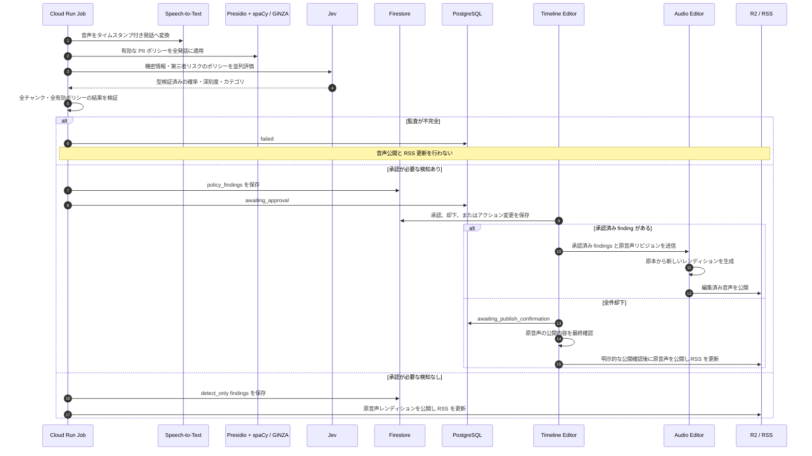

# Jev 音声監査・自動校正ポリシー仕様と実装計画

## 1. 目的と適用範囲

タイムスタンプ付き文字起こしを、ローカル PII 検出器と Jev の高速判定で評価し、公開前の音声コンテンツから次のリスクを検出・記録・編集する。

- 個人情報
- 機密情報
- 第三者リスク（批判、誹謗中傷、名誉毀損のおそれ）
- 番組ごとのカスタムポリシー（例: 勤務先名）

著作権リスクは本仕様の対象外とする。音楽・音声の権利判断は文字起こしだけでは完結しないため、必要になった時点で音声指紋と権利情報を含む別機能として設計する。

既存の Jev ファクトチェック監査および AI ディレクター訂正介入は、すでに事実確認の要件を満たしているため本仕様の変更対象外とする。既存の `director_interventions`、`insert_correction`、および公開境界を維持し、新しい音声校正ポリシーは並行して導入する。

## 2. 安全性の原則

1. **有効な監査はフェイルクローズにする。** 対象チャンクの不足、重複、応答の形式不正、確率値の範囲外、Jev API 障害、または PII 検出器の実行障害のいずれも、音声公開と RSS 更新を停止して `failed` に遷移する。
2. **検知と公開可否を分離する。** `detect_only` の検出は公開を止めない。一方、監査そのものが完了しない場合は検出モードを問わず公開しない。
3. **確率と深刻度を混同しない。** `probability` は「ポリシー違反である確率」、`severity` は発見時の影響度を表す独立した値である。既存 Jev の `score` を確率として再利用しない。
4. **自動編集は限定する。** 初期リリースの全ポリシーは、`detect_only` または `require_approval` とする。不可逆なリップル削除はユーザー承認なしに実行しない。
5. **原本は変更しない。** 編集は原音声を不変に保ち、承認済み検知結果から新しい配信用レンディションを生成する。編集済み音声を次回の編集入力にしない。
6. **根拠を追跡可能にする。** 各検知結果にポリシーバージョン、監査対象チャンク、文字起こしおよび原音声のリビジョン、モデル名、判定確率、閾値を保存する。

## 3. ポリシー定義

### 3.1 標準ポリシー

| Policy ID | 検知内容 | 一次判定 | 初期モード | 初期アクション | 初期閾値 |
|---|---|---|---|---|---:|
| `personal_information` | 電話番号、メールアドレス、住所など | Presidio + spaCy / GiNZA + 日本語向けカスタム Recognizer | `require_approval` | `replace_with_beep` | エンティティ種別ごと |
| `confidential_information` | 顧客名、案件名、非公開の社内情報 | Jev | `require_approval` | `silence` | 0.85 |
| `third_party_risk` | 誹謗中傷、名誉毀損、攻撃的な第三者評価 | Jev | `require_approval` | `silence` | 0.85 |

### 3.2 個人情報検出器

PII 検出はネットワーク呼び出しを必要としない Python プロセス内のハイブリッド検出器とする。ライセンスは導入前に依存関係単位で確認し、MIT または Apache-2.0 で商用利用可能なものだけを採用する。

1. **Microsoft Presidio** を Recognizer のオーケストレーター、エンティティ競合解決、および共通のスコア形式に使用する。
2. **spaCy + GiNZA** を日本語の形態素解析・固有表現認識バックエンドとして接続する。Presidio とのアダプター互換性を検証し、直接接続できない場合は同一の共通スパン形式を返す `JapanesePiiAnalyzer` アダプターを実装する。
3. 電話番号、メールアドレス、郵便番号、URL、識別子形式は Presidio のパターン Recognizer と日本向けのカスタム Recognizer で決定的に検出する。
4. 住所・人名・組織名は GiNZA の固有表現と文脈ルールを組み合わせる。誤検知を避けるため、エンティティ種別ごとに `threshold` を設定する。
5. Jev は PII の一次検出器にしない。ローカル検出で得られない文脈的な個人情報を補助的に分類する必要が生じた場合のみ、明示的に有効化した二次検出器として使用する。

検出器は各エンティティの文字オフセットを返し、文字起こしセグメントの `start_ms` / `end_ms` に対応付ける。初期実装ではセグメント全体を編集区間としてよいが、UI 上では検出された文字列だけを根拠として表示する。

### 3.3 カスタムポリシー

カスタムポリシーは番組単位で設定する。完全一致または表記ゆれを許容した単語照合を一次判定にし、文脈を要する場合のみ Jev 判定を追加する。

```json
{
  "policy_id": "employment-name-check",
  "version": 1,
  "name": "勤務先名チェック",
  "kind": "custom_terms",
  "enabled": true,
  "terms": ["Cisco", "シスコ", "ユーザベース"],
  "normalization": ["trim", "lowercase", "unicode_nfkc"],
  "execution_mode": "require_approval",
  "action": "silence",
  "threshold": 1.0
}
```

カスタム語句の完全一致は決定的検出であり、`probability` は `1.0` とする。Jev による意味的拡張を有効にした場合だけ、Jev の校正済み確率と設定閾値を使用する。

### 3.4 実行モードとアクション

| 種別 | 値 | 意味 |
|---|---|---|
| 実行モード | `auto` | 検知確率が閾値以上であれば編集ジョブへ送る。初期リリースでは使用しない。 |
| 実行モード | `require_approval` | UI で対象音声を確認してから編集する。 |
| 実行モード | `detect_only` | 検知結果のみを保存・表示し、編集しない。 |
| アクション | `none` | 音声を編集しない。 |
| アクション | `silence` | 対象区間をフェード付きで無音化する。 |
| アクション | `replace_with_beep` | 対象区間を 1 kHz の正弦波に置換する。 |
| アクション | `cut` | 対象区間を削除して前後を結合する。必ず承認を要する。 |
| アクション | `insert_correction` | 既存の AI ディレクター訂正音声を挿入する。必ず承認を要する。 |

`auto` を将来有効化する場合も、決定的な個人情報検出に対する `silence` または `replace_with_beep` に限定する。`cut` と `insert_correction` は常に `require_approval` とする。

### 3.5 Jev コンテンツリスク判定の統合案

`confidential_information` と `third_party_risk` は、既存の `FactCheckAuditor` に統合できる。`AsyncTypeSafeClient.system_one()` は1チャンクに複数の型付き質問を送れるため、既存の `noul`、`score`、`choice` に加えて、各ポリシー専用の `Noul` 質問を同一リクエストに含める。

既存の `audit_chunks()` と `FactCheckAuditMetric` の戻り値は変更しない。新たに `audit_chunk_bundle(s)` を追加して、ファクトチェック結果とポリシー検知結果を含む `AuditBundle` を返す。移行後のワークフローだけが bundle API を使うため、既存ファクトチェックの呼び出し元・公開停止条件・テストを壊さない。

| Jev 質問 ID | 型 | 閾値 | ルール草案 |
|---|---|---:|---|
| `confidential_information` | `Noul` | 0.85 | 発話に、一般公開を想定しない顧客名、案件名、契約・価格・売上・障害・ロードマップ、社内手続、認証情報またはその他の業務上の秘密が含まれるかを判定する。公開済みの情報、一般論、発話者自身が公開すると明示した情報だけでは検出しない。不確実な場合は低い確率にせず、公開確認が必要な可能性として確率を評価する。 |
| `third_party_risk` | `Noul` | 0.85 | 発話が、特定または特定可能な個人・組織・集団について、事実として断定された否定的主張、侮辱、犯罪・不正・能力不足の示唆、または評判を害し得る表現を含むかを判定する。法的な名誉毀損の結論は出さず、公開前の人手確認が必要なリスク信号としてのみ判定する。対象を特定できない一般論、建設的で根拠を添えた批評、自己批判は原則として検出しない。 |

両質問の返却値は `0.0` から `1.0` の有限値として既存の `_bounded_number()` で検証する。質問の欠落、未知の応答形式、または検証不能な値は、既存 Jev 監査と同様に `ReviewIncompleteError` として公開を停止する。閾値以上の finding は必ず `require_approval` にし、`confidential_information` と `third_party_risk` の初期アクションはともに `silence` とする。

機密情報の辞書・許可語は番組の管理者が番組単位で管理する。辞書に一致しても許可語に一致する場合は finding を作らず、辞書・許可語の変更は `policy_version` を更新する。

## 4. データモデル

### 4.1 検知結果

新しい音声校正ポリシーの検知結果は、Firestore の `policy_findings` に保存する。既存ファクトチェックの `director_interventions` は移行しない。

**パス**:

```text
podcasts/{podcast_id}/episodes_contents/{episode_id}/policy_findings/{finding_id}
```

```json
{
  "finding_id": "9f7341e8-6c0c-4d73-8c6b-c424c1183db7",
  "policy_id": "personal_information",
  "policy_version": 1,
  "category": "personal_information",
  "source": "presidio_spacy_ginza",
  "chunk_id": "seg_00042",
  "start_ms": 195200,
  "end_ms": 198600,
  "evidence_text": "連絡先は example@example.com です",
  "probability": 0.97,
  "threshold": 0.9,
  "severity": 4,
  "execution_mode": "require_approval",
  "requested_action": "replace_with_beep",
  "status": "pending",
  "audio_revision": "source:sha256:...",
  "transcript_revision": "sha256:...",
  "model": "jev-model-id",
  "created_at": "2026-10-08T10:00:00Z"
}
```

| フィールド | 説明 |
|---|---|
| `source` | `presidio_spacy_ginza`、`jev`、`term_match`、または複合検出器。 |
| `probability` | 検知対象に該当する校正済み確率。決定的なパターン検出は `1.0`。 |
| `severity` | 1〜5 の影響度。エンティティ種別とポリシーから決定する。 |
| `start_ms` / `end_ms` | 編集対象区間。チャンク境界より狭い範囲を検出できない初期実装では、発話セグメント全体を使用する。 |
| `status` | `pending`、`approved`、`rejected`、`applied`、`superseded`、`failed`。 |
| `audio_revision` | 検知時の不変な原音声リビジョン。異なるリビジョンへの適用を拒否する。 |

既存の `director_interventions` は変更しない。UI は `director_interventions` を既存の事実確認・訂正提案として、`policy_findings` を本仕様の音声校正提案として、それぞれ読み取る。

### 4.2 ポリシー設定

番組設定に `audit_policies` を追加する。ポリシー変更後に過去の検知結果の意味が変わらないよう、各検知結果へ `policy_version` をコピーする。

```json
{
  "audit_policies": [
    {
      "policy_id": "third_party_risk",
      "version": 1,
      "enabled": true,
      "execution_mode": "require_approval",
      "action": "silence",
      "threshold": 0.85
    }
  ]
}
```

## 5. 処理フロー



## 6. UI 要件

1. 波形と文字起こしに `policy_findings` の区間を重ねて表示する。
2. リストにはポリシー名、時刻、確率、推奨アクション、対象テキストを表示する。
3. `require_approval` の項目は、ユーザーが「承認」「却下」「アクション変更」を選べるようにする。
4. `detect_only` の項目には編集ボタンを表示しない。
5. 編集開始は、すべての `require_approval` 検知が `approved` または `rejected` になった場合だけ許可する。承認済み項目がない場合は `awaiting_publish_confirmation` に遷移し、原音声の公開内容を確認する明示的な公開操作を完了するまで、R2 と RSS を更新しない。
6. UI は原音声と対象リビジョンが一致しない検知結果を編集できないようにする。

## 7. 実装計画

### フェーズ 0: 契約の確定

- ポリシー ID、アクション、実行モード、確率・深刻度の意味を本書どおりに固定する。
- `auto` を初期状態で無効化する。
- `cut` と `insert_correction` は常に承認必須とするバリデーションを定義する。`confidential_information` と `third_party_risk` の初期アクションは `silence` に固定する。
- 完了条件: Pydantic / Zod の契約テストで不正な組み合わせを拒否できる。

### フェーズ 1: バックエンド検知基盤

- `PolicyFinding`、`AuditPolicy`、`AuditResult` のドメインモデルを追加する。
- 既存 `FactCheckAuditor` の `audit_chunks()` と事実確認の公開境界は変更しない。同クラスに bundle API を追加し、同一の Jev リクエストで機密情報・第三者リスクを評価する。
- Microsoft Presidio を中心に、spaCy + GiNZA と日本語向けカスタム Recognizer を接続した `JapanesePiiAnalyzer` を実装する。Presidio と GiNZA の実行互換性、モデルサイズ、コールドスタート、各依存関係のライセンスを検証する。
- 電話番号、メールアドレス、郵便番号、URL、識別子形式を決定的に検出し、住所・人名・組織名は GiNZA の固有表現と文脈ルールで検出する。
- カスタム語句の決定的検出器を実装する。
- 有効なすべてのポリシー・すべてのチャンクの結果完全性を検証する。
- 完了条件: PII 検出器または Jev の障害、部分応答、重複、未知カテゴリ、非有限確率、チャンク不一致の全てで公開が停止する。既存ファクトチェックの振る舞いとテストは変わらない。

### フェーズ 2: 保存・状態遷移・移行

- `policy_findings` の Firestore リポジトリを追加する。
- `director_interventions` は変更せず、`policy_findings` を新しい音声校正ポリシー専用の保存先にする。
- `awaiting_approval` への遷移条件を「承認必須の検知が1件以上」に変更する。
- すべての承認必須項目が判断済みであることを公開または編集の前提にする。
- 全件却下時は `awaiting_publish_confirmation` に遷移し、明示的な公開確認後だけ原音声を R2 と RSS に反映する。
- 完了条件: 再実行時に結果が重複せず、旧形式の介入提案が UI で読み取れる。

### フェーズ 3: UI と承認 API

- 既存の AI ディレクター訂正パネルを維持しつつ、`policy_findings` の検知一覧、波形マーカー、文字起こしハイライトを追加する。
- 承認 API に楽観ロックまたは状態条件を追加し、`awaiting_approval` 以外での編集起動を拒否する。
- 全件却下時に原音声の公開内容を確認する画面と、`awaiting_publish_confirmation` からだけ実行できる公開 API を追加する。
- 完了条件: 利用者が各検知を試聴し、承認・却下・アクション変更を行え、未判断項目を残して公開できない。全件却下時も最終公開確認なしに公開できない。

### フェーズ 4: 音声編集ジョブ

- 編集ジョブ入力を区間ベースの `policy_findings` に変更する。
- FFmpeg で `silence`、`replace_with_beep`、`cut` を実装する。各処理に前後フェードを付ける。
- 原音声のハッシュとジョブ入力の `audio_revision` が異なる場合は編集を拒否する。
- 編集後の音声のみを R2 と RSS に反映し、原音声を上書きしない。
- 完了条件: 既知の時間範囲に対する波形・長さ・ビープ周波数・リップル削除後の結合を自動テストできる。

### フェーズ 5: 運用と限定自動化

- ポリシー別に検知数、承認率、却下率、編集失敗率、公開停止数を記録する。
- 誤検知・見逃しの評価データセットを整備する。
- 十分な実測値と人手レビューを満たした場合だけ、決定的な個人情報検出に対する `silence` または `replace_with_beep` を番組単位で opt-in 提供する。
- 完了条件: 自動実行が明示的な設定、対象アクション、対象ポリシー、閾値の全条件を満たさなければ実行されない。

## 8. テスト計画

| 領域 | 必須テスト |
|---|---|
| ポリシー設定 | 未知の policy / action、閾値範囲外、`auto + cut`、`auto + insert_correction` を拒否する。 |
| Jev 統合 | 既存ファクトチェックの必須回答の欠落、NaN、範囲外確率、未知の分類、部分チャンク結果で公開停止する。機密情報・第三者リスクの各回答についても同じ不完全応答テストを行う。 |
| PII 検出 | 日本の電話番号、メール、郵便番号、URL、住所・人名・組織名、および正規化済みカスタム語句をタイムスタンプ付きで検出する。 |
| 状態遷移 | 承認必須項目がある場合に公開せず `awaiting_approval` になる。全件却下では `awaiting_publish_confirmation` となり、明示的な公開確認後にだけ原音声を公開する。承認ありでは編集ジョブへ進む。 |
| 編集 | 無音化、ビープ置換、カットが指定区間だけに適用され、原音声が保持される。 |
| 再実行 | 同じ入力で検知結果が重複せず、異なる音声リビジョンへの古い検知結果適用を拒否する。 |
| 既存監査 | `FactCheckAuditor` の不完全監査時の公開停止と、既存 `director_interventions` の訂正フローを回帰テストする。 |

## 9. レビュー時の決定事項

実装開始前に次を確認する。

1. 初期版で個人情報検出に含める形式（日本の電話番号、メール、住所の粒度）。
2. 機密情報の辞書・許可語は、番組の管理者が番組単位で管理する。
3. `third_party_risk` の初期アクションは `silence` とする。
4. 全件却下後は `awaiting_publish_confirmation` へ遷移し、別途公開確認を必須にする。
5. 原音声の保管場所、保持期間、および編集済みレンディションのオブジェクトキー規則。
