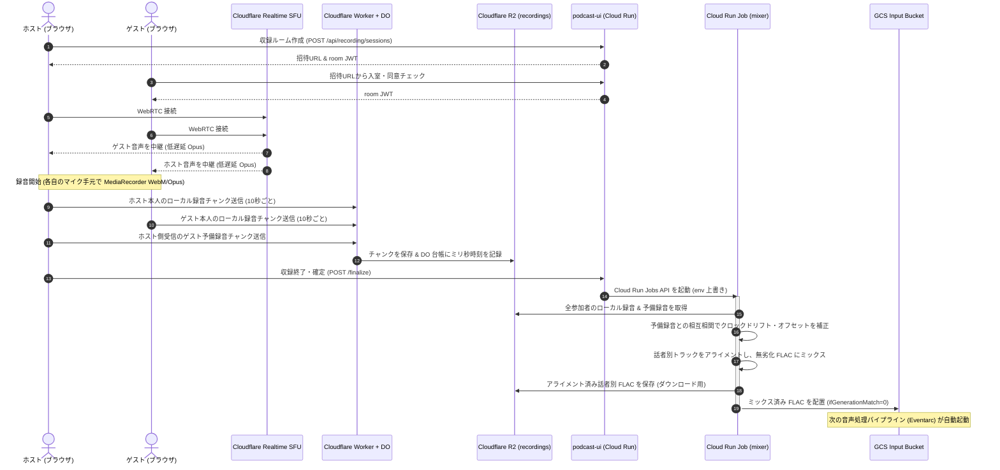
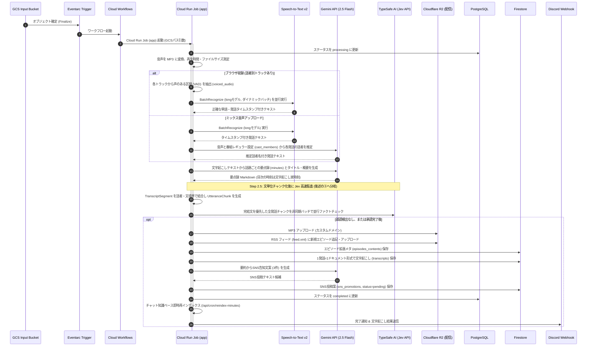
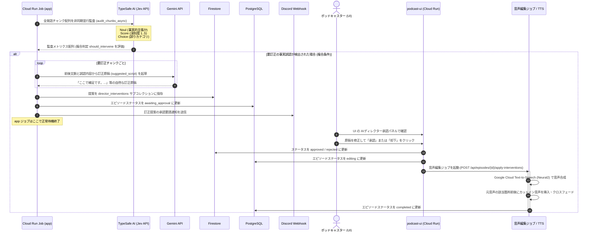
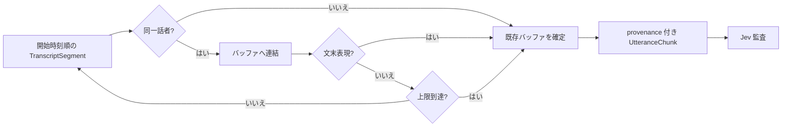
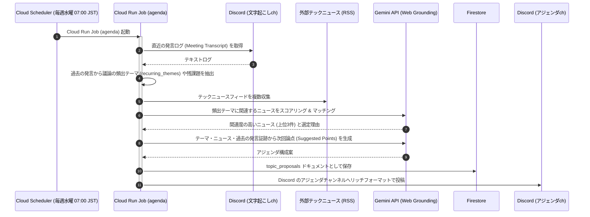
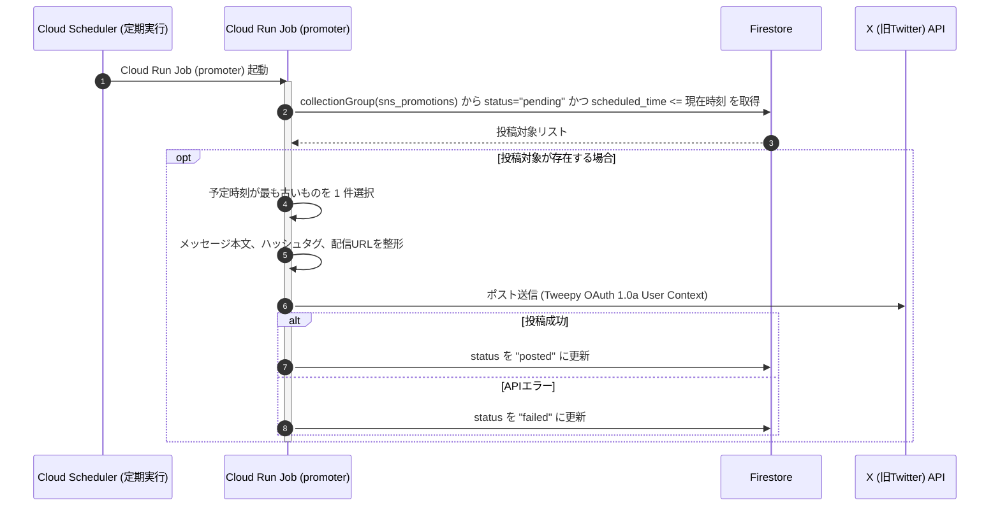
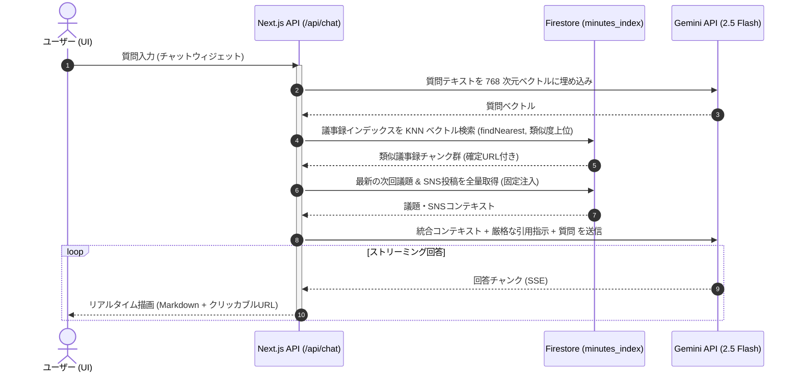

# SparkCast 処理パイプライン詳細仕様

本ドキュメントでは、SparkCast において稼働する6つの自律的・自律分散型処理パイプラインの詳細なフロー、シーケンス図、エラーハンドリング、および最適化ロジックについて解説します。

> [!NOTE]
> 関連ドキュメント：
> - [システムアーキテクチャ全体像](file:///Users/onotakayoshi/Documents/Projects/sunabalog/SparkCast/sparkcast/docs/system_architecture.md)
> - [データベース・ストレージスキーマ](file:///Users/onotakayoshi/Documents/Projects/sunabalog/SparkCast/sparkcast/docs/database_and_storage_schema.md)
> - [サービスコンセプト・アピールポイント・AIエージェント](file:///Users/onotakayoshi/Documents/Projects/sunabalog/SparkCast/sparkcast/docs/service_concept.md)

---

## 1. パイプライン一覧

SparkCast は、収録から配信、プロモーション、ナレッジ再利用までを完全自動化・支援するため、以下の6つのパイプラインが連携して動作します。

| # | パイプライン名 | 実行トリガー | 実行コンポーネント |
|:---|:---|:---|:---|
| **1** | **ブラウザ収録・音源ミキシング** | ホストによる収録終了操作 | Next.js UI → Cloud Run Job (`mixer`) |
| **2** | **音声処理・AI解析・配信** | GCS への音声ファイル確定 | Eventarc → Workflows → Cloud Run Job (`app`) |
| **3** | **AIディレクター介入・訂正** | 音声処理内 (Jev監査) / UI承認 | TypeSafe AI (Jev) → UI → Cloud Run Job (`editor`) |
| **4** | **週次アジェンダ自動生成** | Cloud Scheduler (毎週水曜 07:00 JST) | Cloud Run Job (`agenda`) |
| **5** | **SNS自動プロモーション投稿** | Cloud Scheduler (定期実行) | Cloud Run Job (`promoter`) |
| **6** | **多ソースRAG・ベクトル同期** | エピソード完了時 / 毎朝 04:00 JST | Next.js API (`/api/cron/reindex-minutes`) |

---

## 2. ① ブラウザ収録・音源ミキシングパイプライン

Discord や外部録音ツールを不要にし、ブラウザの通話から話者別録音・高精度ミキシングまでを一貫して行うエッジ＆サーバーレスパイプラインです。

### 2.1 処理シーケンス図

### 2.2 設計の勘所と最適化

1. **通話と録音の分離（エッジ・ブラウザ最適化）**
   - 通話は Cloudflare Realtime SFU（月 1TB 転送無料）を通し、録音は各端末のブラウザ上で非圧縮に近いレート（MediaRecorder WebM/Opus 128kbps）で手元保存。
   - 通話回線の揺らぎやパケットロスが、録音音声の品質に一切影響しません。
2. **ホスト予備録音と相互相関（Cross-Correlation）アライメント**
   - ホスト側のブラウザは、ゲストから受信した音声もバックアップとして録音します。
   - mixer ジョブは、ゲストの手元録音とホスト側の予備録音との間で 8kHz / 8秒窓による相互相関（cross-correlation）を計算し、端末ごとのクロックずれ（1時間で数十〜数百ms）を1次式（offset と drift）で補正（FFmpeg `atempo` フィルタ適用）。
   - 「ホストに聞こえていたタイミング」に揃えることで、違和感のない自然な掛け合いを再現します。

---

## 3. ② 音声処理・AI解析・配信パイプライン

GCS への音声配置を契機に、音声認識・要約・文字起こし・RSS/R2公開を自動実行するコアパイプラインです。

### 3.1 処理シーケンス図

### 3.2 音声認識の最適化とフォールバック

1. **ダイナミックバッチによるコスト削減（約80%削減）**
   - Speech-to-Text v2 の `long` モデル（東京リージョン `asia-northeast1`）を採用。
   - ダイナミックバッチ（1分 $0.003）を使用することで、通常認識（1分 $0.016）に比べコストを約 80% 削減。
2. **有声区間抽出（VAD: Voiced Audio Detection）**
   - ブラウザ収録の話者別トラックに対し、本人の声がある区間のみを抽出（雑音 + 10dB、前後余白付き）して音声認識へ投入。
   - 無音部分の認識リクエストを省くことで、認識時間を 60〜70% 短縮し、費用をさらに削減。
3. **二重のフォールバック・安全策**
   - **音声認識障害時**: Speech-to-Text がエラーとなった場合は、Gemini 2.5 Flash の音声モーダル直接入力による文字起こし（`gemini_audio`）へ自動フォールバック。
   - **無音検出時**: 発話が 1 件も検出されなかった場合（ミュート収録等）、AI 要約に回さずエピソードを直ちに `failed` にして空回りを防止。

---

## 4. ③ AIディレクター介入・訂正パイプライン

配信音声中の事実誤認や言い間違いを AI が自律的に検出し、人間の承認を経て自然な音声カットインで訂正する先進的な品質管理パイプラインです。

### 4.1 処理シーケンス図

### 4.2 Jev 高速監査と複合判定基準 (Composite Criteria)

- **Noul (客観的事実判定)**: 発言に客観的・検証可能な事実的主張（技術仕様、数値、固有名詞等）が含まれるか (0.0〜1.0)。
- **Score (深刻度 1〜5)**:
  - `1`: 軽微な言い間違い / 事実に基づいている / スルー可
  - `2`: 軽微な誤り / 文脈上問題なし (ただし重要カテゴリかつ高確信度の場合は介入対象)
  - `3`: **明確な事実誤認 / 要訂正（ディレクター介入対象）**
  - `4`: 重大な誤認 / 信頼性に関わる（ディレクター介入対象）
  - `5`: 致命的な誤認 / 損害・混乱を招く（ディレクター介入対象）
- **Choice (カテゴリ分類)**: `technology`, `proper_noun`, `numerical_data`, `historical_fact`, `other`。

#### 介入要否の複合判定ロジック (`FactCheckAuditMetric.should_intervene`)
単なる Score の閾値だけでなく、Noul と Choice を組み合わせることで**「誤検知（False Positive）の防止」**と**「重要カテゴリの取りこぼし防止」**を両立しています：
1. **客観的事実の有無 (Noul 足切り)**: `noul < 0.6`（感想、挨拶、相槌、比喩・冗談など）の場合は、不要なツッコミを防ぐため Score に関わらず介入除外。
2. **重大・明確な事実誤認**: `score >= 3` かつ `noul >= 0.6` は介入対象。
3. **重要カテゴリの軽微な誤り**: `score == 2` であっても、リスナーへの影響や信頼性に直結する重要カテゴリ（`technology`, `numerical_data`, `proper_noun`）かつ高確信度（`noul >= 0.8`）の場合は介入対象として検出。

### 4.3 音声校正ポリシー監査 (PII・機密情報・第三者リスク)

ファクトチェックと並行して、各 `UtteranceChunk` をローカルの Microsoft Presidio + spaCy/GiNZA で検査します。日本の電話番号、メール、郵便番号、URL、GiNZA の人名・組織名・住所エンティティ、および番組単位のカスタム機密語を、元の `start_ms` / `end_ms` とともに `policy_findings` へ保存します。`presidio-analyzer`、spaCy、GiNZA、ja-GiNZA はいずれも MIT ライセンスです。

Jev には `confidential_information` と `third_party_risk` の型付き `Noul` 質問も送ります。PII 検出器の初期化・実行失敗、欠落した質問、NaN、範囲外値、未知の応答形式はすべてフェイルクローズとし、R2 への音声アップロードおよび RSS 更新を行いません。検知時の既定アクションは `require_approval` / `silence` であり、自動カットや訂正音声の挿入は行いません。

番組管理者は `podcasts.audio_audit_policy` の `confidential_terms` と `allowed_terms` を番組ごとに管理し、変更時に `version` を更新します。各 finding にそのバージョンを保存することで、判断時点のポリシーを追跡できます。

`policy_findings` は UI で全件を `approved` または `rejected` に判断するまで、編集・公開を開始できません。承認済み finding は既存の音声編集ジョブへ `policyFindings` として渡され、原音声を変更せず新しいレンディションを生成します。全件を却下した場合は `awaiting_publish_confirmation` へ遷移し、管理者が原音声の公開を明示確認した場合だけ、監査を再実行せずに R2 と RSS の公開を再開します。

### 4.4 Jev 監査用 UtteranceChunk の文再構成仕様

#### 現状の課題

`TranscriptSegment` は音声認識器が返す時間区間であり、文の終端で分割される保証はありません。一方、`UtteranceChunk` を `TranscriptSegment` と 1 対 1 にすると、「この機能は無料で」のような不完全な述語・係り受けの発話を Jev に渡すことがあります。この場合、事実主張の判定 (`noul`) と誤認の深刻度 (`score`) に必要な主語・数値・否定表現・対象語が別チャンクとなり、見逃しと誤検知の双方が増えます。

したがって、Jev の監査単位は STT の物理的な分割単位ではなく、**同一話者による完結文を優先して再構成した論理単位**とします。`TranscriptSegment` は表示・編集位置を追跡する原データとして保持し、監査対象の `UtteranceChunk` は別途生成します。

#### チャンク化フロー

1. `TranscriptSegment` を開始時刻順に処理し、空白正規化のみを行います。原文、話者、開始・終了時刻、話者 ID は変更しません。
2. 現在のバッファと次のセグメントの話者 ID が同一なら、自然な空白を挿入してテキストを連結します。話者 ID が存在しない場合だけ、話者表示名が同一であることを代替条件とします。
3. 連結後のバッファから文末表現（`。`, `！`, `？`, `!`, `?`。直後の閉じ引用符も同じ文に含める）ごとに文を切り出し、それぞれを 1 個の `UtteranceChunk` として確定します。1 セグメント内に複数文がある場合も同様に分割し、末尾の未完部分だけを次のセグメントまでバッファに残します。句読点のない STT 出力では、次の話者交替または終端までバッファを継続します。
4. 話者交替、文字起こし末尾、または後述の上限到達時にはバッファを確定します。話者をまたいだ結合は、会話の帰属と訂正対象時刻を壊すため禁止します。
5. 確定したチャンクには、構成元の `segment_ids`、先頭 `start_ms`、末尾 `end_ms`、`is_complete_sentence`、確定理由を保存します。カットイン位置は常に `end_ms` とし、監査用テキストの長さでは算出しません。

#### 上限・例外処理

- **推奨上限**: 1 チャンクは 30 秒または 500 文字のいずれか先に達した時点で確定します。長い独話で監査の焦点と API レイテンシが悪化することを防ぎます。
- **不完全チャンク**: 話者交替・音声末尾・上限によって確定し、文末表現がないものは `is_complete_sentence=false` とします。これは捨てずに Jev へ送りますが、プロンプトには「発話が途中で切れている可能性」を明示します。後続文との推測的な結合や、異なる話者との結合は行いません。
- **短い相槌**: 単独で確定した「あの」「はい」などは監査対象に残しても `noul` 足切りで介入除外されます。隣接した別話者の発話へ吸収して文脈を変えません。
- **重複防止**: 文を分割した場合を除き、各 `TranscriptSegment` はちょうど 1 個の `UtteranceChunk` に属します。1 セグメント内の複数文は同じセグメント時刻を共有し、それぞれのチャンクに同じ `segment_ids` を記録します。チャンク ID は構成元 `segment_ids` と出現順から安定に導出し、リトライ時の重複した介入提案を防ぎます。

#### 評価・受入基準

実装前に、実際の STT 結果から無作為抽出した少なくとも 100 文を正解ラベル付き評価セットとし、現行の 1 セグメント 1 チャンク方式と比較します。

| 観点 | 測定方法 | 受入基準 |
|:---|:---|:---|
| 完全文率 | 人手で完結文と判定したチャンク数 / 全監査チャンク数 | 95% 以上（句読点付き STT 入力） |
| 文の分断率 | 1 文が複数チャンクに分割された正解文数 / 全正解文数 | 現行方式より 80% 以上削減 |
| 話者混在率 | 複数話者の `segment_ids` を含むチャンク数 / 全チャンク数 | 0% |
| 時刻整合性 | チャンクの `start_ms` / `end_ms` と構成元セグメント最小開始・最大終了時刻の一致 | 100% |
| 監査品質 | 既知の事実誤認ケースに対する Jev の介入判定の再現率・適合率 | 現行方式を下回らず、分断されていた誤認ケースは再現率を改善 |
| 介入位置 | 承認済み介入の挿入時刻と対象チャンク末尾時刻の一致 | 100% |

テストには、文中で分割された事実主張、句読点なしの連続発話、引用符付き文末、同名話者ではない話者交替、30 秒・500 文字の各上限、音声末尾の不完全文を必ず含めます。評価結果が基準を満たさない場合は、文末表現の規則を拡張する前に STT の句読点有無と話者ダイアライゼーション精度を切り分けます。

---

## 5. ④ 週次アジェンダ自動生成パイプライン

ポッドキャスターの次回収録準備を支援するため、過去の対話ログと外部最新ニュースを結びつけてアジェンダを自動生成するパイプラインです。

---

## 6. ⑤ SNS自動投稿パイプライン

公開されたエピソードの認知拡大を図るため、適切なタイミングで X (旧Twitter) へ自律的に告知投稿を行うパイプラインです。

---

## 7. ⑥ 多ソースナレッジチャット (RAG) ＆ ベクトル同期パイプライン

過去の全エピソード議事録、次回アジェンダ、SNS投稿を横断して、質問に正確に回答する知識検索パイプラインです。

### 7.1 ベクトル同期（即時 ＋ 日次バッチ）

- **エピソード完了時の即時同期**: `app` ジョブが完了した直後に、UI の `/api/cron/reindex-minutes?podcastId={id}` を呼び出し。配信直後のエピソードもチャットですぐに参照可能。
- **毎朝 04:00 JST の差分再インデックス**: Cloud Scheduler が定期実行。
  - 各ソース（`minutes`, `agenda`, `sns`）のコンテンツハッシュを `minutes_index_meta` と比較。
  - 変更があったソースのみを Vertex AI `text-multilingual-embedding-002`（768次元）で再ベクトル化。
  - 削除されたエピソードのインデックスを自動クリーンアップ（冪等性の担保）。

### 7.2 チャット検索と回答生成（リアルタイム）

- **ハルシネーション（リンク切れ）の根本対策**: リンク先 URL はコンテキスト注入時にプログラム側で確定（`/?episode=42`, `/agenda?proposal=...` 等）させ、Gemini には「指定された URL を一字一句そのまま出力する」ことだけを指示。URL の勝手な推測生成を完全に防止しています。
