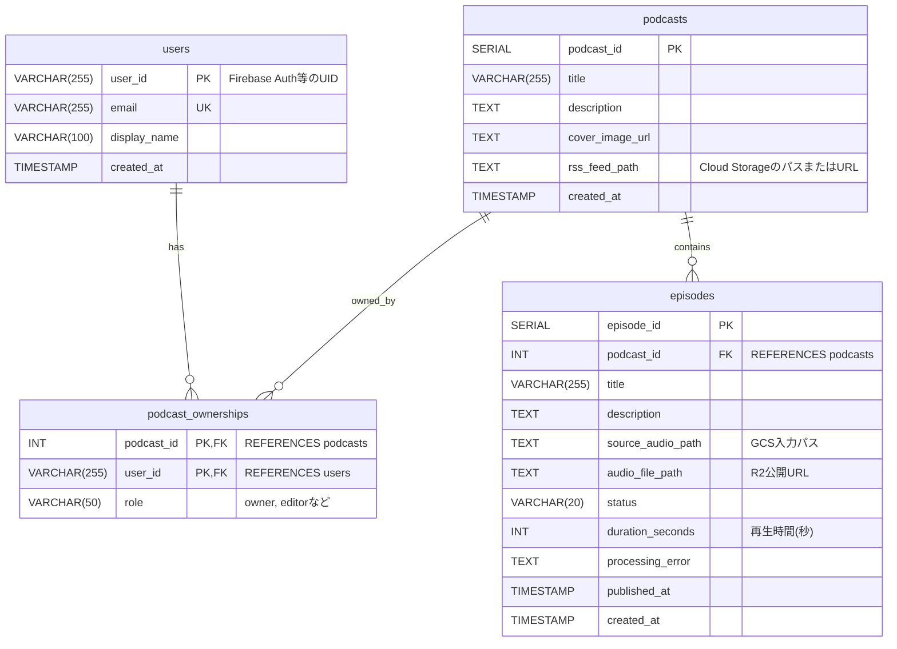

# Podcast Data Schema Specification

## 変更サマリー

本仕様は、Cloud SQL（PostgreSQL）を基幹データ、Firestoreを生成コンテンツ/運用コンテンツの格納先として扱うハイブリッド構成を定義する。

設計方針は次の通り。

1. 正規化が必要な主体データ（ユーザー、番組、エピソード、権限）はCloud SQLに保存する
2. AI生成物や時系列で増加する断片データ（文字起こしチャンク、SNS投稿候補、議題提案）はFirestoreに保存する
3. エピソードIDを共通キーとして、Cloud SQLとFirestoreを疎結合で接続する

## 1. Cloud SQL（PostgreSQL）ER図



## 2. Cloud SQL テーブル仕様

### users

| カラム | 型 | 制約 | 説明 |
|---|---|---|---|
| user_id | VARCHAR(255) | PK, NOT NULL | Firebase Auth UID |
| email | VARCHAR(255) | UNIQUE, NOT NULL | ログインメール |
| display_name | VARCHAR(100) | NULL | 表示名 |
| created_at | TIMESTAMP | NOT NULL, DEFAULT now() | 作成日時 |

### podcasts

| カラム | 型 | 制約 | 説明 |
|---|---|---|---|
| podcast_id | SERIAL | PK | 番組ID |
| title | VARCHAR(255) | NOT NULL | 番組タイトル |
| description | TEXT | NULL | 番組説明 |
| cover_image_url | TEXT | NULL | カバー画像URL |
| rss_feed_path | TEXT | NULL | RSSファイルの保存先 |
| created_at | TIMESTAMP | NOT NULL, DEFAULT now() | 作成日時 |

### podcast_ownerships

| カラム | 型 | 制約 | 説明 |
|---|---|---|---|
| podcast_id | INT | PK, FK -> podcasts.podcast_id | 番組ID |
| user_id | VARCHAR(255) | PK, FK -> users.user_id | ユーザーID |
| role | VARCHAR(50) | NOT NULL | owner, editor など |

### episodes

| カラム | 型 | 制約 | 説明 |
|---|---|---|---|
| episode_id | SERIAL | PK | エピソードID |
| podcast_id | INT | FK -> podcasts.podcast_id, NOT NULL | 所属番組 |
| title | VARCHAR(255) | NOT NULL | エピソードタイトル |
| description | TEXT | NULL | 説明文 |
| source_audio_path | TEXT | NULL | GCS入力オブジェクトパス |
| audio_file_path | TEXT | NULL | 処理後の公開音声URL |
| status | VARCHAR(20) | NOT NULL | upload_pending, uploaded, processing, completed, failed |
| duration_seconds | INT | NULL | 再生時間（秒） |
| processing_error | TEXT | NULL | 失敗理由 |
| processing_started_at | TIMESTAMP | NULL | 処理開始日時 |
| processing_completed_at | TIMESTAMP | NULL | 処理終了日時 |
| published_at | TIMESTAMP | NULL | 公開日時 |
| created_at | TIMESTAMP | NOT NULL, DEFAULT now() | 作成日時 |

## 3. Firestore ドキュメント構造仕様

Cloud SQLの podcast_id / episode_id を識別子として使用し、以下を格納する。

### 3.1 エピソード拡張コンテンツ（親ドキュメント）

パス:

podcasts/{podcast_id}/episodes_contents/{episode_id}

```json
{
  "updated_at": "2026-06-06T10:12:00Z",
  "transcript_summary": "このエピソードでは、大規模データやテキストデータを扱う際のデータベースの選定基準について話しています。特にCloud SQLとFirestoreを...",
  "ai_generated_meta": {
    "title": "【AI提案】生成AI時代のデータベース選定ガイド",
    "description": "今回はGoogle CloudのRDBとNoSQLの使い分けについて、Podcastの運用を例に挙げながら深掘りします。",
    "prompt_version": "v1.2",
    "generated_at": "2026-06-06T09:05:00Z"
  },
  "show_notes_summary": {
    "overview": "Google Cloudの各データベースの特徴と、Podcast管理システムにおける具体的な組み合わせ方法について議論しました。",
    "topics": [
      { "time": "00:00", "title": "オープニング" },
      { "time": "03:15", "title": "なぜ文字起こしデータはFirestoreに最適なのか" },
      { "time": "15:40", "title": "エンディング" }
    ]
  }
}
```

### 3.2 文字起こし断片（サブコレクション）

パス:

podcasts/{podcast_id}/episodes_contents/{episode_id}/transcripts/{chunk_id}

```json
{
  "start_time": 12.5,
  "end_time": 15.0,
  "speaker": "ゲストA",
  "text": "ここでCloudSQLとFirestoreの使い分けについてですが…"
}
```

### 3.3 SNS宣伝用投稿文（サブコレクション）

パス:

podcasts/{podcast_id}/episodes_contents/{episode_id}/sns_promotions/{promotion_id}

```json
{
  "status": "pending",
  "scheduled_time": "2026-06-01T10:00:00+09:00",
  "episode": {
    "number": 41
  },
  "message": "今回のテーマ: AI product strategy\\n\\nWe discussed AI product strategy updates.",
  "platform_urls": {
    "apple": "https://podcasts.apple.com/example-1",
    "spotify": "https://open.spotify.com/show/example-1",
    "amazon": "https://music.amazon.com/podcasts/example-1"
  },
  "hashtags": [
    "#Podcast",
    "#AI"
  ]
}
```

### 3.4 次回収録向けの議題提案（トップレベル）

パス:

podcasts/{podcast_id}/topic_proposals/{proposal_id}

```json
{
  "proposal_id": 123,
  "target_period_string": "2026年 第23週 (06/01 - 06/07)",
  "generated_at": "2026-06-06T17:00:00Z",
  "related_news": [
    {
      "title": "Google Cloud、Cloud SQLの次世代アーキテクチャを発表",
      "url": "https://example.com/news/cloud-sql-next",
      "summary": "パフォーマンスが大幅に向上し、NoSQLライクな柔軟なインデックス機能が追加...",
      "source_reason": "エピソード #5 で話した課題を解決する手段としてタイムリーなため。"
    }
  ],
  "suggested_topics": [
    {
      "title": "発表されたCloud SQLの最新機能を、僕らのPodcastアプリに導入するべきか？",
      "description": "先日発表されたCloud SQLのアップデート内容を解説しつつ...",
      "suggested_points": [
        "新機能の概要と、自分たちの現在のアーキテクチャの振り返り",
        "コスト面・パフォーマンス面での移行メリットの有無"
      ],
      "related_past_episodes": [5, 8]
    }
  ]
}
```

## 4. Constraints & Indexes

### PostgreSQL 制約

1. podcast_ownerships.role は owner または editor を許容値とする
2. episodes.duration_seconds は 0 以上
3. episodes.published_at は episodes.created_at 以降
4. episodes.status は定義済み状態のみを許可する

### PostgreSQL 推奨インデックス

1. CREATE INDEX idx_episodes_podcast_created_at ON episodes (podcast_id, created_at DESC);
2. CREATE INDEX idx_episodes_podcast_published_at ON episodes (podcast_id, published_at DESC);
3. CREATE INDEX idx_podcast_ownerships_user_role ON podcast_ownerships (user_id, role);

### Firestore 推奨インデックス

1. collectionGroup: sns_promotions に対して (status ASC, scheduled_time ASC)
2. collectionGroup: transcripts に対して (speaker ASC, start_time ASC)（必要時）
3. podcasts/{podcast_id}/topic_proposals に対して (generated_at DESC)

## 5. Cloud SQL と Firestore の責務分離

### Cloud SQL に保存するもの

- ユーザー
- 番組
- 権限（誰がどの番組を編集できるか）
- エピソードの主データ

### Firestore に保存するもの

- AI生成メタ情報
- 文字起こしチャンク
- SNS投稿候補（予約投稿状態含む）
- 次回収録向け議題提案

## 6. Migration Plan

1. Cloud SQLで users, podcasts, podcast_ownerships, episodes を先行作成
2. 既存アプリのID運用を podcast_id, episode_id に寄せる
3. Firestore に episodes_contents と各サブコレクションを作成
4. 投稿予約バッチ（Cloud Run）を collectionGroup(sns_promotions) ベースで接続
5. 運用開始後、検索頻度に応じて追加インデックスを作成

## 7. Open Questions

1. podcast_ownerships.role に viewer を含めるか
2. sns_promotions.status の状態遷移を pending -> success/failed 以外に拡張するか
3. episode.number を Cloud SQL 側で持つか（現在はSNSドキュメント内の補助情報）
4. transcript_summary の多言語対応（言語コード保持）を行うか

## 8. MP3アップロード連携契約

`podcast-ui` はCloud SQLにエピソードを作成し、ブラウザからGCSへ直接PUTするための署名付きURLを発行する。

GCSオブジェクトパス:

```text
podcasts/{podcast_id}/episodes/{episode_id}/source/{filename}
```

`podcast-automator` はGCS finalizeイベントで受け取るオブジェクトパスから
`podcast_id`と`episode_id`を抽出し、Cloud SQLおよびFirestoreへの書き戻しに使用する。
API詳細と制約は `docs/contracts/episode-upload.md` を参照する。
