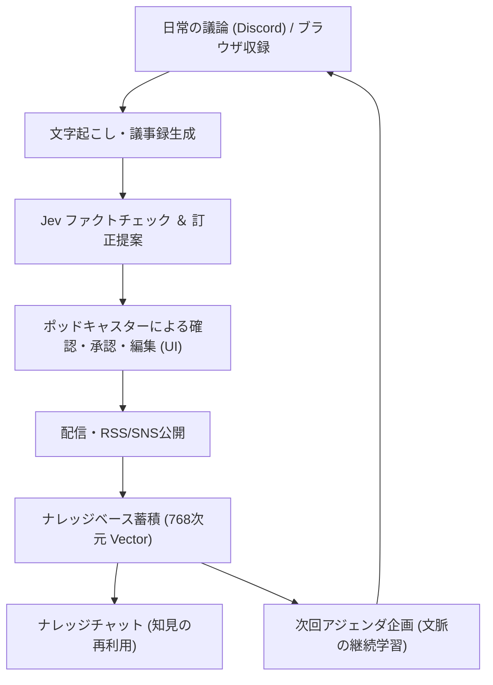

# SparkCast サービスコンセプト・アピールポイント・AIエージェント

本ドキュメントでは、SparkCast の目指す世界観、3つのコアコンセプト（つくる・まわす・とどける）、システム内で自律的に活躍する5つのAIエージェントの役割、およびAIを継続的に育て活用するエコシステムについて解説します。

> [!NOTE]
> 関連ドキュメント：
> - [システムアーキテクチャ全体像](file:///Users/onotakayoshi/Documents/Projects/sunabalog/SparkCast/sparkcast/docs/system_architecture.md)
> - [データベース・ストレージスキーマ](file:///Users/onotakayoshi/Documents/Projects/sunabalog/SparkCast/sparkcast/docs/database_and_storage_schema.md)
> - [処理パイプライン詳細](file:///Users/onotakayoshi/Documents/Projects/sunabalog/SparkCast/sparkcast/docs/processing_pipelines.md)

---

## 1. サービスビジョン

> **「話すことだけに集中できる、ポッドキャスターのための自律運転スタジオ」**

従来のポッドキャスト制作・運用には、複雑で多くの手間がかかっていました。
1. Discord などの通話ツールで集まり、別個のボットやアプリで録音
2. 音声ファイルを手動でダウンロードし、DAW や動画ソフトで位置合わせ・編集
3. 音声ファイルを手動でホスティングにアップロードし、文字起こしツールにかけ、ショーノートを執筆
4. RSS フィードを更新し、SNS の告知文を手動で考えて投稿
5. 次回収録のネタを毎回ゼロから調査・選定

SparkCast は、**ブラウザでの通話・収録から、AIによる音声アライメント、正確な文字起こし、ファクトチェック監査、訂正カットイン音声合成、RSS/SNS配信、次回企画、過去回のナレッジ検索まで** を単一プラットフォームで自律化します。ポッドキャスターは「話すこと」そのものに熱中し、AIエージェントが伴走してコンテンツの価値を最大化します。

---

## 2. コアコンセプトとアピールポイント

SparkCast は、**「つくる」「まわす」「とどける」** の3大コアコンセプトに沿って強力な価値を提供します。

```mermaid
flowchart LR
    subgraph C1 ["Concept 1: つくる (Build)"]
        A1["話者・時刻付き高精度文字起こし"]
        A2["TypeSafe Jev ファクトチェック監査"]
        A3["AIディレクター音声カットイン訂正"]
        A4["会話コンテキスト学習型アジェンダ企画"]
        A5["多ソースRAGナレッジ検索"]
    end

    subgraph C2 ["Concept 2: まわす (Operate & Grow)"]
        B1["ブラウザ収録ルーム (WebRTC/SFU)"]
        B2["Human-in-the-Loop 承認サイクル"]
        B3["Eventarc × Workflows 自律運転"]
        B4["GitHub Actions & Terraform IaC"]
        B5["徹底的なコスト最適化"]
    end

    subgraph C3 ["Concept 3: とどける (Deliver)"]
        C_1["Cloud Run Jobs 高負荷サーバーレス"]
        C_2["Cloudflare R2 エグレス無料配信"]
        C_3["X (旧Twitter) 自動プロモーション"]
        C_4["署名付きURL & 多層防御セキュリティ"]
    end

    C1 --> C2 --> C3
```

### Concept 1: つくる (Build)
> [!NOTE]
> **最先端の AI 技術を中核に、実務で本当に役立つインテリジェントなコンテンツ制作支援を実現します。**

* **話者別・正確なタイムスタンプ付き文字起こし（Speech-to-Text v2 × Gemini）**
  - 単なる全文テキスト化にとどまらず、Speech-to-Text v2 の `long` モデル（東京リージョン）とブラウザ収録の話者別トラックを連携。
  - 発話ごとの正確な時刻（ミリ秒単位）と話者名を記録し、議事録の目次タイムスタンプが音声の実際の位置と完全に一致します。
* **TypeSafe AI (Jev) による高速ファクトチェック監査 ＆ AIディレクター**
  - 発話チャンクに対し、TypeSafe AI「Jev」が Noul (事実的主張か), Score (深刻度1〜5), Choice (誤りカテゴリ) の3軸で高速並行バッチ監査。
  - 重大な事実誤認（Score >= 3）が検出された場合、Gemini が自然な訂正原稿を起草し、Google Cloud Text-to-Speech（Neural2）の高品質音声合成により、音声中にディレクターとしてカットイン訂正を挿入できます。
* **対話コンテキスト学習型アジェンダ自動企画（Web Grounding）**
  - 日常の議論が交わされる Discord の発言ログから頻出テーマ（`recurring_themes`）を抽出し、外部の最新テックニュース（RSS）と照合して関連度スコアを算出。
  - 「前回話したこの課題の解決策として、タイムリーなこのニュースについて議論する」といった、番組固有の文脈を踏まえた実践的な論点付きアジェンダを自動生成します。
* **多ソースRAGナレッジアシスタント**
  - 配信済みの議事録だけでなく、次回アジェンダやSNS投稿までを統合した多ソースナレッジベースを構築。
  - Vertex AI `text-multilingual-embedding-002`（768次元）によるベクトル検索と厳格な確定URL引用指示により、ハルシネーション（リンク切れ）のない正確な出典リンク付き回答を提供します。

---

### Concept 2: まわす (Operate & Grow)
> [!TIP]
> **運用負荷をゼロに近づける自律自動運転と、AIを継続的に改善するエコシステムを構築します。**

* **ブラウザ収録ルーム（グループ通話から配信までの完全統合）**
  - Cloudflare Realtime SFU と各自のブラウザ録音（MediaRecorder WebM/Opus）を組み合わせることで、通話品質に左右されない高品質録音と月1TBまでの転送量無料を実現。
  - ホスト予備録音との相互相関（cross-correlation）アライメントにより、端末間の時計のズレ（クロックドリフト）を自動補正してFLACにミックス。外部ツールを行き来する手間を完全に排除しました。
* **Human-in-the-Loop（人間とAIの協調サイクル）**
  - AIディレクターによる訂正提案は、Next.js UI 上でポッドキャスターが確認・編集・承認・却下を選択可能。
  - 配信の最終決定権を常に人間が握りつつ、面倒な確認・起草作業はAIに委ねる理想的な協調ワークフローを実現しています。
* **イベント駆動＆スケジュールによる「自律自動運転」運用**
  - 音声が置かれれば Eventarc → Cloud Workflows → Cloud Run Job が自動で起動し、定刻になれば Cloud Scheduler がアジェンダ作成やSNS投稿、差分再インデックスを実行。人手を介さずバックグラウンドで自律的にサイクルが回転します。
* **徹底的なコスト最適化設計**
  - Speech-to-Text v2 のダイナミックバッチ採用（通常認識の約1/5の費用）、有声区間抽出（VAD）による無音スキップ、Cloudflare R2（エグレス無料）、Supabase 無料枠（PostgreSQL）の活用により、運用固定費を極小化しています。

---

### Concept 3: とどける (Deliver)
> [!IMPORTANT]
> **本番品質のスケーラブルなインフラで、コンテンツを世界中のリスナーへ確実に届けます。**

* **Cloud Run Jobs による高負荷音声処理のサーバーレス実行**
  - 音声のデコード、相互相関計算、無劣化FLACミックス、MP3エンコードなど、一時的に高負荷を要するバッチ処理を最大 8GiB メモリ / 2 CPU の Cloud Run Jobs に分離。
  - 処理実行時のみ課金され、完了後は即座にリソースを開放するスケーラブルな構成です。
* **Cloudflare R2 によるエグレス転送量無料のグローバル配信**
  - 生成された高音質 MP3 音声ファイルおよびポッドキャスト RSS フィード（`feed.xml`）は、カスタムドメインを割り当てた Cloudflare R2 でホスト。
  - Apple Podcasts、Spotify、Amazon Music 等で数万〜数十万回再生されてもエグレス費用が発生しません。
* **自律型ソーシャルプロモーション**
  - エピソード公開後、あらかじめ生成・予約された魅力的なプロモーションメッセージを X API（OAuth 1.0a User Context）経由で自律的にポスト。リスナーへの認知拡大を自動化します。
* **堅牢なセキュリティと多層防御**
  - Firebase Authentication、HMAC署名付き招待キー、二重のJWT（room JWT / service JWT）、事前登録メールゲート、API利用レート制限、GCS V4署名付きURL（直接PUT・最大500MiB）により、セキュアで安全な運用を担保しています。

---

## 3. 5大AIエージェントの明確な役割分担

SparkCast では、AIは単なる「便利機能」ではなく、コンテンツ創出から配信、振り返りまでを自律的に担当する「AIエージェント」としてデザインされています。

| エージェント名 | 担当領域 | 主な役割・機能 | コア技術・モデル |
|:---|:---|:---|:---|
| **① 文字起こし・議事録エージェント** | 音声処理 | 音声データを解析し、発話ごとの正確な時刻と話者を記録。話題ごとの要点録（目次・要点・決定事項・ToDo）、タイトル、ショーノートを自動作成。 | Speech-to-Text v2 (`long`) + Gemini 2.5 Flash |
| **② AIディレクター・ファクトチェックエージェント** | 品質管理 | 発話内容に含まれる事実誤認や言い間違いを高速監査（Score >= 3）。訂正スクリプトを起草し、承認された内容を高品質音声合成でカットイン挿入。 | TypeSafe AI (Jev API) + Gemini 2.5 Flash + Cloud TTS (Neural2) |
| **③ 企画・リサーチエージェント** | アジェンダ生成 | Discord の過去の対話ログから頻出テーマを抽出し、外部テックニュース RSS とマッチング（Web Grounding）。次回話すべき論点と関連ニュースを自動提案。 | Gemini 2.5 Flash + Web Grounding + RSS Fetcher |
| **④ 宣伝クリエイターエージェント** | SNS配信 | エピソードの本質を捉えた魅力的な紹介文、適切なハッシュタグ、各プラットフォームURLを含む投稿案を起草・スケジュール予約。 | Gemini 2.5 Flash |
| **⑤ ナレッジキーパーエージェント** | 知識検索 (RAG) | 過去の全配信エピソード、次回アジェンダ、SNS投稿を記憶。自然言語での質問に対し、確定URL付きで正確に出典を明示しながら回答。 | Vertex AI Embedding (768次元) + Firestore Vector Search + Gemini |

---

## 4. AIエージェントを「育て活用する」エコシステム

SparkCast におけるAIエージェントは、使えば使うほど配信チームのスタイルや関心を学習し、パートナーとして共に成長します。

1. **日常の対話からの継続的コンテキスト学習**
   - 収録時の音声だけでなく、Discord 上での日常的なやり取りやアイデア出しのログを定期的に学習。
   - 配信チームがいま何に関心を持っているか、どのようなトーンで議論しているかを理解し、アジェンダ提案の精度が継続的にパーソナライズされます。
2. **Human-in-the-Loop による編集フィードバック**
   - AIが生成したタイトル、説明文、SNS投稿案、ディレクター訂正案は、すべて UI 上で人間が介入・修正できます。
   - 人間の修正傾向をプロンプト改善やファクトチェック基準のチューニングへフィードバックすることで、よりチームの好みに合ったコンテンツ生成へと進化します。
3. **データ循環型のナレッジ再利用サイクル**
   - 配信されたエピソードは即座にベクトル化され、過去の全資産として蓄積されます。
   - 過去の自分の発言や技術的判断をチャットで瞬時に引き出せるため、過去の議論と矛盾しない一貫性のあるコンテンツ制作や、過去回を踏まえた発展的な議論が可能になります。
