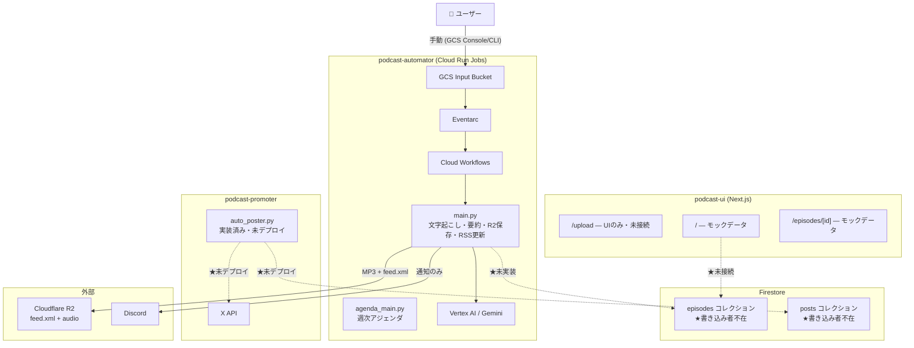
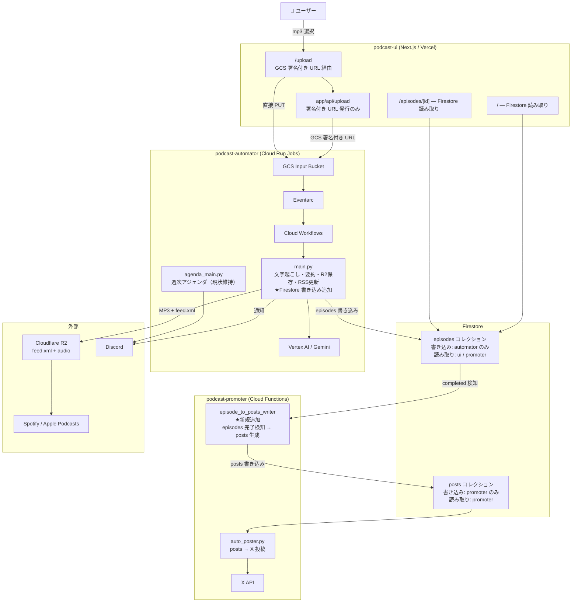

# Podcast Automator — System Overview

**最終更新**: 2026-06-05
**対象ブランチ/フェーズ**: PoC〜ハッカソン完了時点

---

## このドキュメントの目的

リポジトリが複数存在するため、「何がどこにあるか」「誰が何を責任を持つか」をチーム全員が同じ認識を持てるようにする。

## 更新ルール

- **頻繁に更新しない**。コードコメントや README の役割ではない
- 以下が変わった場合のみ更新する:
  - 責務境界（どのリポジトリが何を担うか）
  - 主要コンポーネントの追加・廃止
  - データフローの変更（どのストレージに何が書かれるか）
- 実装の詳細（関数名・スキーマの細部・設定値）はここに書かない

---

## 1. プロジェクト一言定義

| リポジトリ | 役割 |
|---|---|
| **podcast-automator** | 音声をアップロードするだけで文字起こし・要約・配信まで自動化する **バックエンドパイプライン** |
| **podcast-ui** | 処理結果を確認・操作するための **管理コンソール（フロントエンド）** |
| **podcast-promoter** | 配信完了後に X（Twitter）への告知を **自動投稿** するサービス |
| **podcast-manager** | 将来の **本格 CMS** の仕様定義（PoC 段階では実装しない） |

---

## 2. As-Is 構成（現状・2026-06-05 時点）

> ⚠️ 事実ベースで記載。未実装・空白を明示する。

### 現状の問題点

| 問題 | 詳細 |
|---|---|
| **Firestore に episodesデータを書く処理が存在しない** | podcast-automator は処理結果を Discord に流して捨てている |
| **podcast-ui は Firestore に繋がっていない** | 全画面がモックデータで動作している |
| **podcast-promoter の posts コレクションへの書き込み手がいない** | auto_poster.py は実装済みだが、入力データが存在しない |

### As-Is 全体図

---

## 3. To-Be 構成（推奨・PoC 完了時点）

> 🔵 提案ベースで記載。チームで合意が必要。詳細は `docs/adr/ADR-001-repository-responsibility-boundary.md` を参照。

### 設計原則

- **podcast-automator がシステムの中心**。全ての自動処理はここで完結する
- **Firestore が全サービス間のバス**。UI・promoter はここを通じてデータを受け取る
- **UI は Firestore を読むだけ**。直接書き込まない
- **Next.js app/api は薄い中継のみ**。ビジネスロジックは持たない

### To-Be 全体図

### Implementation Mapping

> **このセクションは PoC 実装管理用です。**  
> Issue 番号は進行中のプロジェクトに依存するため、Issue のクローズ・番号変更に伴い内容が変わる可能性があります。  
> 恒久的な設計情報ではなく、PoC 期間中の実装追跡を目的としています。

To-Be 全体図の各コンポーネント・データフローと、対応する GitHub Issue の対応表。

| To-Be 要素 | 内容 | 対応 Issue |
|---|---|---|
| Firestore クライアント初期化 | automator から Firestore に接続する基盤 | [podcast-automator#98](https://github.com/sunaba-log/podcast-automator/issues/98) |
| Firestore episodes 書き込み | automator が処理完了後に episodes ドキュメントを作成 | [podcast-automator#99](https://github.com/sunaba-log/podcast-automator/issues/99) |
| Firestore status 反映 | `uploaded → processing → completed / failed` を episodes に更新 | [podcast-automator#100](https://github.com/sunaba-log/podcast-automator/issues/100) |
| Firebase SDK セットアップ | podcast-ui で Firebase SDK と環境変数を設定 | [podcast-ui#1](https://github.com/sunaba-log/podcast-ui/issues/1) |
| UI Firestore 読み取り | podcast-ui が episodes を一覧・詳細表示 | [podcast-ui#2](https://github.com/sunaba-log/podcast-ui/issues/2) |
| GCS 署名付き URL 発行 | `app/api/upload` で署名付き URL を発行 | [podcast-ui#3](https://github.com/sunaba-log/podcast-ui/issues/3) |
| UploadForm GCS PUT | ブラウザから GCS に直接アップロード | [podcast-ui#4](https://github.com/sunaba-log/podcast-ui/issues/4) |
| episodes → posts 生成 | completed episode を検知して posts ドキュメントを 3 件生成 | [podcast-promoter#1](https://github.com/sunaba-log/podcast-promoter/issues/1) |
| promoter デプロイ | X 投稿処理を Cloud Functions / Cloud Run へデプロイ | [podcast-promoter#2](https://github.com/sunaba-log/podcast-promoter/issues/2) |
| Scheduler / Pub/Sub | promoter の定期実行トリガー設定 | [podcast-promoter#3](https://github.com/sunaba-log/podcast-promoter/issues/3) |

---

## 4. 責務境界の定義

### podcast-automator（バックエンドパイプライン）

**持つ責務:**
- GCS Input Bucket（Terraform で管理）
- Eventarc → Cloud Workflows → Cloud Run Job のインフラ
- Gemini による文字起こし・要約生成
- 音声変換（MP3）と Cloudflare R2 へのアップロード
- R2 の `feed.xml` 更新（RSS 管理）
- **Firestore `episodes` コレクションへの書き込み**（現在空白・要追加）
- Discord 通知
- 週次アジェンダ Job

**持たない責務:**
- UI ロジック
- X への最終投稿処理

---

### podcast-ui（管理コンソール）

**持つ責務:**
- Next.js フロントエンド全般
- Firestore `episodes` からの読み取りと表示
- `/upload`: GCS 署名付き URL 発行（`app/api/upload`）とブラウザからの直接 PUT

**持たない責務:**
- Firestore への書き込み
- 音声処理ロジック
- RSS 生成

**Next.js app/api の制約:**
- GCS 署名付き URL 発行のみ
- 認証実装後はセッション検証をここに追加する
- それ以外のビジネスロジックは持たない

---

### podcast-promoter（X 自動投稿）

**持つ責務:**
- Firestore `episodes` の completed を検知して `posts` ドキュメントを生成・書き込む
- `posts` から pending を読んで X API に投稿する
- Cloud Scheduler / Pub/Sub の設定

**持たない責務:**
- 音声処理
- RSS 管理

---

### podcast-manager（将来 CMS）

**現状:** 仕様書（spec.md）のみ。実装コードなし。

**PoC 期間中の扱い:** 実装しない。podcast-ui で代替する。

**将来:** 本格 CMS として実装する場合は、podcast-ui の機能を段階的に移管し、RSS 管理も podcast-automator から移管する。その際は別途 ADR を作成する。

---

## 5. 外部コンポーネント早見表

| コンポーネント | 用途 | 操作リポジトリ |
|---|---|---|
| **GCS** | 音声ファイルの受け取り | automator（所有）/ ui（署名付き URL 経由で PUT） |
| **Cloudflare R2** | MP3 公開配信 + feed.xml（RSS） | automator のみ |
| **Firestore `episodes`** | エピソードデータの永続化 | 書き込み: automator / 読み取り: ui, promoter |
| **Firestore `posts`** | X 投稿スケジュール | 書き込み: promoter / 読み取り: promoter |
| **Vertex AI / Gemini** | 文字起こし・要約生成 | automator のみ |
| **Discord Webhook** | 処理通知・週次アジェンダ | automator のみ |
| **X API** | 告知投稿 | promoter のみ |
| **Spotify / Apple Podcasts** | 配信プラットフォーム | R2 の feed.xml を参照（自動） |
