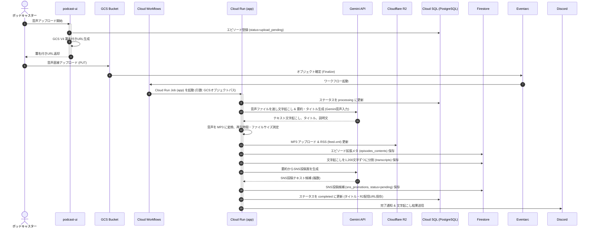
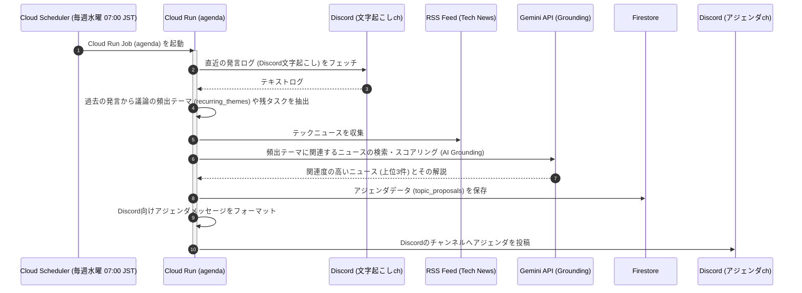
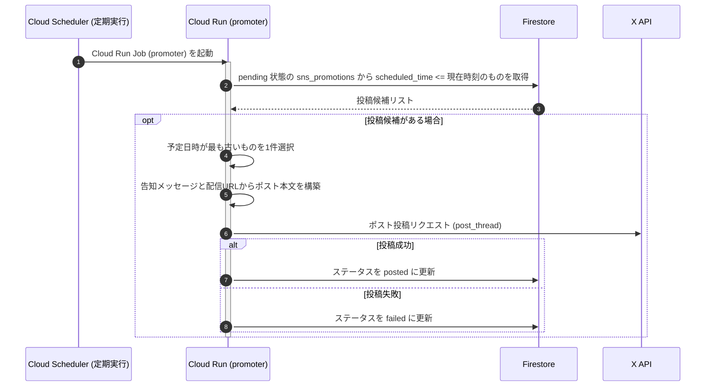

# SparkCast システムアーキテクチャ

本ドキュメントでは、ポッドキャスト配信・編集支援システム「SparkCast」のシステムアーキテクチャ、コンポーネント構成、処理パイプライン、AIエージェントの役割と育成サイクル、および扱うデータモデルについて詳細にまとめます。

---

## 1. システム全体像とアーキテクチャ

本システムは、Next.jsで構築されたフロントエンド兼管理API（`ui`）と、Google Cloud / Cloudflare / 外部APIを連携させたPythonバッチ群（`automator`）による疎結合なハイブリッドアーキテクチャを採用しています。

### 1.1 システムアーキテクチャ図

#### 物理ソリューションアーキテクチャ図 (サービスアイコン表現)


#### 論理構成・データフロー図 (Mermaid)

```mermaid
flowchart TD
    %% ユーザーとUI
    User["ポッドキャスター (ブラウザ)"] <-->|操作 / 管理| UI["Next.js UI (podcast-ui)"]
    UI -->|認証| Auth["Firebase Authentication"]
    
    %% UIからDB/ストレージへの直接的な「Next.js API経由」接続
    UI <-->|API / Server Component| SQL[("Cloud SQL (PostgreSQL)")]
    UI <-->|API / Server Component| FS[("Firestore (NoSQL)")]
    UI -->|署名付きURL発行| GCS_Bucket["GCS Input Bucket"]
    User -->|音声直接アップロード (PUT)| GCS_Bucket

    %% 音声アップロードトリガーのパイプライン
    GCS_Bucket -->|オブジェクト確定イベント| Eventarc["Eventarc Trigger"]
    Eventarc --> Workflows["Cloud Workflows"]
    Workflows -->|ジョブ起動 (GCSパス引数)| RunJob_App["Cloud Run Job: app (音声処理)"]

    %% 音声処理ジョブの入出力
    RunJob_App <-->|ステータス更新| SQL
    RunJob_App -->|変換後音声 (MP3) & RSS| R2[("Cloudflare R2")]
    RunJob_App -->|文字起こし / AIメタ / SNS投稿案| FS
    RunJob_App -->|音声テキスト化 / 要約| Gemini["Vertex AI (Gemini API)"]
    RunJob_App -->|処理結果・文字起こし通知| Discord_Info["Discord (ログ・Webhook)"]

    %% アジェンダ生成パイプライン
    Scheduler_Agenda["Cloud Scheduler (週次)"] -->|ジョブ起動| RunJob_Agenda["Cloud Run Job: agenda (アジェンダ生成)"]
    RunJob_Agenda <-->|過去の会話ログ取得| Discord_Transcript["Discord (文字起こしチャンネル)"]
    RunJob_Agenda -->|ニュース取得| RSS_News["外部テックニュース (RSS)"]
    RunJob_Agenda <-->|アジェンダ提案保存| FS
    RunJob_Agenda -->|関連ニュースマッチング| Gemini
    RunJob_Agenda -->|アジェンダ投稿| Discord_Agenda["Discord (通知・Webhook)"]

    %% SNSプロモーションパイプライン
    Scheduler_Promo["Cloud Scheduler (定期)"] -->|ジョブ起動| RunJob_Promo["Cloud Run Job: promoter (SNS自動投稿)"]
    RunJob_Promo <-->|予約データ取得 & 状態更新| FS
    RunJob_Promo -->|自動ポスト| X_API["X (旧Twitter) API"]

    %% 議事録チャット (RAG) パイプライン
    UI <-->|議事録検索 (Vector)| FS
    UI <-->|RAG回答生成 / 埋め込み| Gemini
    Cron_Reindex["Cloud Scheduler (毎日04:00 JST)"] -->|再インデックスAPI| UI
```

### 1.2 アーキテクチャの特徴
- **ハイブリッドデータベース設計**: 正規化が必要で厳密な一貫性を求めるマスタデータ（ユーザー、番組、エピソード、所有権）は **Cloud SQL (PostgreSQL)** に格納し、AI生成メタデータや文字起こしテキスト、時系列のSNS投稿案などの半構造データは **Firestore (NoSQL)** に格納するハイブリッド構成をとっています。
- **GCS ID契約による疎結合連携**: `podcast-ui` と `podcast-automator` はデータベースを直接共有しているものの、音声処理の連携はGCSのオブジェクトパス `podcasts/{podcast_id}/episodes/{episode_id}/source/{filename}` を介した「ID契約」に基づいて非同期に開始されます。これにより、フロントエンドとバックエンドのパイプラインが疎結合に保たれています。
- **サーバーレス＆イベント駆動**: 音声のアップロード契機で Eventarc と Cloud Workflows を経由して Cloud Run Job が起動し、アジェンダ生成やSNS投稿は Cloud Scheduler で必要時にのみ起動するため、インフラコストとリソース消費を最小化しています。

---

## 2. 各層別のコンポーネント構成

本システムは、機能と責務に応じて以下の5つのレイヤーに整理されます。

### 2.1 UI / フロントエンド層（`podcast-ui`）
- **エピソード一覧画面（ステータス表示）**: 専用の管理ダッシュボード画面はなく、エピソード一覧画面での処理ステータス表示がその役割を担っています。配信状況や処理ステータスの確認が可能です。
- **エピソードエディタ**: 新規エピソードの作成、音声ファイルのアップロード、AIが自動生成したタイトルや説明文、文字起こし結果の確認・手動編集。
- **RAGチャットUI**: 画面右下のチャットウィジェットから、過去の配信内容（議事録）について自然言語で問い合わせるためのUI。
- **SNS投稿管理**: AIが生成したXへの自動投稿案（スケジューリング日時、投稿本文）の確認・編集・削除用UI。承認操作はなく、pending状態の投稿は予定時刻になると自動で投稿されます（編集や削除は可能です）。

### 2.2 Web API / アプリケーション層（`podcast-ui`）
- **認証API（Firebase Auth）**: Googleアカウントによるログイン認証。
- **GCS署名付きURL生成API**: ブラウザから直接GCSセキュアに大容量音声をアップロードするためのV4署名付きURLを発行する。
- **RAGチャットAPI**: 認証トークンの検証後、クライアントとストリーミング接続し、Firestoreのベクトル検索結果をコンテキストとしてGeminiで回答を生成・ストリーミング返却する。
- **再インデックス（ベクトル化）API**: 議事録テキストを Vertex AI の埋め込みモデルでベクトル化し、Firestore（`minutes_index`）へ同期する。

### 2.3 バッチ / バックエンド処理層（`podcast-automator`）
- **音声処理バッチ（`app`）**: GCSへの音声確定をトリガーに動作。音声のデコード・MP3変換・R2アップロード、Geminiによる文字起こし・要約・SNS投稿案生成、RSS（`feed.xml`）の更新、Cloud SQLステータス更新を行う。
- **アジェンダ生成バッチ（`agenda`）**: 毎週水曜に定期実行。Discordの文字起こし発言ログおよびRSSテックニュースから、Geminiを活用して次回の収録アジェンダを創出する。
- **SNS自動投稿バッチ（`promoter`）**: 定期実行。Firestoreから公開期限が到来した `pending` 状態の投稿メッセージを取得し、X API（OAuth 1.0a User Context: Tweepy の consumer key/secret + access token 方式）経由で投稿（`x_api.py`）し、ステータスを `posted` に更新する。

### 2.4 データ / ストレージ層
- **Cloud SQL (PostgreSQL)**: トランザクション一貫性が必要な認証ユーザー、番組、番組の編集・所有権、エピソードマスタ（処理状態ステータスを含む）を保持。
- **Firestore (NoSQL)**: ドキュメントサイズ制約（1MB）を考慮し、1,200文字以内にチャンク分割された文字起こし断片（`transcripts`）、AI生成の拡張コンテンツ（`episodes_contents`）、投稿予約（`sns_promotions`）、次回アジェンダ（`topic_proposals`）、およびRAG用ベクトル（`minutes_index`）を管理。
- **Google Cloud Storage (GCS)**: 音声ファイルの初期アップロードおよび処理前の一時格納領域（ライフサイクル管理により自動削除）。
- **Cloudflare R2**: 配信用のMP3ファイル、RSSフィードファイル（`feed.xml`）をホスト。

### 2.5 AI / LLM 連携層
- **Vertex AI (Gemini API / `@google/genai`)**:
  - `gemini-2.5-flash` / `gemini-2.0-flash-001`: 音声データの直接インプットによる文字起こし（音声モーダル入力）、エピソードの要約とタイトル/説明の生成、SNS投稿案の生成、アジェンダ生成時のニュース選定、RAGチャット回答生成。既定モデルは `gemini-2.5-flash` であり、一部の既定値には `gemini-2.0-flash-001` が使用されています（`gemini-1.5-pro` は使用していません）。
  - `text-multilingual-embedding-002`: 日本語対応の768次元埋め込みモデル。議事録のベクトル検索用インデックス生成に使用。

---

## 3. 主要パイプラインの説明

本システムは、自動運転ポッドキャスト配信を実現するため、4つの自律的なパイプラインが稼働しています。

### 3.1 ① 音声処理・配信パイプライン

エピソード音声のアップロードから公開・メタデータ生成までのエンドツーエンド処理です。



### 3.2 ② アジェンダ自動生成パイプライン

次回のポッドキャスト収録を支援するために、AIが自動でアジェンダと関連ニュースを準備する週次バッチです。



### 3.3 ③ SNS自動投稿パイプライン

公開されたエピソードを、適切なタイミングでX (旧Twitter) に告知するバッチです。



### 3.4 ④ 議事録チャット (RAG) ＆ ベクトル同期パイプライン

配信済みの全エピソードの知見を横断して回答するチャットシステムです。

1. **ベクトル化の同期（毎日 04:00 JST）**:
   - Cloud Scheduler が Next.js API（`/api/cron/reindex-minutes`）を呼び出します（ホスティング環境は Cloud Run であり、Vercel ではありません）。
   - APIはFirestoreの議事録テキストを取得し、Vertex AI `text-multilingual-embedding-002` を介して768次元のベクトルデータを生成します。
   - 未処理、あるいは更新があったエピソードのみを対象にする**冪等（べきとう）設計**で、Firestore上の `minutes_index` サブコレクションへ埋め込みベクトル（`embedding`）を保存します。
2. **チャット検索と生成（リアルタイム）**:
   - ユーザーがUIから質問を入力すると、Next.js APIが質問テキストをベクトル化。
   - Firestoreのベクトル検索（`findNearest`）を用いて、類似度の高い議事録チャンク上位数件（KNN検索）を高速に取得します。
   - 取得した複数の議事録テキストをシステムプロンプトにコンテキストとして埋め込み、Geminiへ入力して最終的な回答を生成、ユーザーにストリーミング（SSE）返却します。
   - ※ インデックスが未作成の初期段階や検索失敗時は、自動的に全文コンテキスト読み込みにフォールバック（縮退動作）してチャット機能を継続させます。

---

## 4. AIエージェントの役割と「育て活用する」仕組み

本システムにおけるAI（Gemini）は、単なるバッチ処理の「機能」としてではなく、コンテンツ創出から配信、振り返りまでを自律的に支援する「AIエージェント」として位置づけられ、それを継続的に育てて活用するエコシステムがデザインされています。

### 4.1 AIエージェントの明確な役割

| エージェントタイプ | 担当パイプライン | 具体的な役割 | 使用モデル・インターフェース |
|:---|:---|:---|:---|
| **文字起こし・要約エージェント** | 音声処理 | 音声データを直接解析し、全文テキスト化。エピソードの本質を捉えた要約を抽出し、番組の魅力的なタイトル候補とエピソード概要説明を自動でライティングする。 | Gemini (音声モーダル直接入力) |
| **宣伝クリエイターエージェント** | 音声処理 | エピソードの概要と特徴から、X（旧X）の文字数制限やハッシュタグを意識した、人目を引く複数のプロモーションメッセージ案を自動で起草する。 | Gemini |
| **企画・リサーチエージェント** | アジェンダ生成 | Discordの文字起こしチャンネルの発言ログから日常的なアイデアや前回の収録でのやり取りの「文脈」を理解し、外部の最新テックニュース（RSS / Google Search グラウンディング）から関連度を測定。Firestore上の議事録は参照しません。次回話すべき「論点（Suggested Points）」を関連ニュースと共に提示する。 | Gemini + Web Grounding (外部RSS / Google Search グラウンディング連携) |
| **ナレッジキーパーエージェント** | RAGチャット | 過去の全ての配信内容（文字起こしベクトル）を「記憶」として保持し、ユーザーの「過去に〜〜について話したのはどの回だっけ？」「〜〜の技術についてどう考えていた？」といった質問に対し、出典（エピソードタイトルとリンク。時間情報はなし。ショーノートの time も `"00:00"` 固定）付きで正確に回答する。 | Gemini + Firestore Vector Search |

### 4.2 AIエージェントを「育て活用する」仕組み

本システムでは、AIエージェントの精度を向上させ、ユーザーであるポッドキャスターにとって最適なパートナーへと「育てる」ための仕組みが設計されています。

#### ① Human-in-the-Loop（人間による修正とUI介入）
AIエージェントは自動でコンテンツを生成しますが、配信・投稿の最終的な決定権は人間にあります。
- **UIでの介入権**: AIが生成したエピソードタイトル、説明文、SNS投稿メッセージ、アジェンダは、`podcast-ui` 上でポッドキャスターが自由に編集・修正可能です。
- **編集結果の記録（現状と課題）**: 現在の実装では、編集は上書き保存のみであり、編集差分や履歴の保存、修正率（Human Edit Rate）を計測する仕組みは存在しません。将来的に編集ログを蓄積することで、AIが生成した初期テキストの「どこが修正されたか（スタイルや好みのズレ）」を評価・収集する育成ループを構築することが目指されています。

#### ② プロンプトのバージョン管理
生成データのメタ情報として、現在は `episodes_contents` の `ai_generated_meta` に固定値 `"v1"` のみが記録されます（`sns_promotions` や `topic_proposals` には記録されません）。
- プロンプトの改善やGeminiモデルのアップグレードを行った際、過去にどのバージョンで生成されたコンテンツであるかを特定するための仕組みの基礎となっています。

#### ③ 過去の会話データからのコンテキストの継続的蓄積
アジェンダ生成ジョブでは、Discordの文字起こしチャンネル（`DISCORD_TRANSCRIPT_CHANNEL_ID`）から過去のメッセージをフェッチし、会話をエピソードごとに再構築して「文脈（recurring_themes）」を抽出します（※Firestore上の過去のエピソード議事録は参照しません）。
- 収録時以外の突発的な議論やDiscord上で発言したアイデアが、エージェントに「記憶」として蓄積されます。
- 日常の対話をコンテキストとして読み込ませ続けることで、AIエージェントは「配信者が今何に関心を持っているか」を学習し、アジェンダ提案の精度や方向性がパーソナライズされ、より配信チームに特化したエージェントへと自動で育っていきます。

#### ④ ナレッジの再利用サイクル (RAG)
配信完了した文字起こしデータは、自動的にベクトル化されて `minutes_index` ベクトルストアに蓄積されます。
- これにより、過去のエピソードという「配信チーム固有の知識ベース」が絶えず構築されます。
- 議事録チャットを介して、過去に配信した知見や過去の自分の意見を即座に引き出し、「あの時話した内容はこれだった」と確認・再利用できます。蓄積された「配信データ」が新たな「企画や回答の精度向上」に直接フィードバックされる、データ循環型の活用サイクルが成立しています。

---

## 5. 扱うデータとデータベース・ストレージスキーマ

ハイブリッド構成における具体的なデータ構造、物理配置、および責務の分離について解説します。

### 5.1 Cloud SQL（PostgreSQL）物理テーブル定義

マスタデータとしての正規化されたリレーショナルテーブルです。

#### 1. `users` (ユーザーマスタ)
Firebase Authentication から同期される管理権限を持つユーザー情報。
- `user_id` (VARCHAR(255), PK): Firebase Auth のUID。
- `email` (VARCHAR(255), UNIQUE, NOT NULL): ログイン用メールアドレス。
- `display_name` (VARCHAR(100), NULL): 表示名。
- `created_at` (TIMESTAMP, DEFAULT now()): ユーザー登録日時。

#### 2. `podcasts` (ポッドキャスト番組マスタ)
配信番組自体のメタデータ。
- `podcast_id` (SERIAL, PK): 番組ID。
- `title` (VARCHAR(255), NOT NULL): 番組タイトル（例: 「すなばろぐ」）。
- `description` (TEXT, NULL): 番組の全体説明。
- `cover_image_url` (TEXT, NULL): カバーアート画像URL。
- `rss_feed_path` (TEXT, NULL): R2等に配置される RSS フィードファイル（`feed.xml`）のオブジェクトパス。
- `created_at` (TIMESTAMP, DEFAULT now()): 作成日時。

#### 3. `podcast_ownerships` (番組所有権マスタ)
ユーザーと番組の編集・閲覧権限の紐付け（N:Mリレーション）。
- `podcast_id` (INT, PK, FK): `podcasts.podcast_id` への参照。
- `user_id` (VARCHAR(255), PK, FK): `users.user_id` への参照。
- `role` (VARCHAR(50), NOT NULL): `"owner"`, `"editor"` などの権限ロール。

#### 4. `episodes` (エピソードマスタ)
エピソードの基本データおよび処理状態ステータス。
- `episode_id` (SERIAL, PK): エピソードID。
- `podcast_id` (INT, FK): `podcasts.podcast_id` への参照。
- `title` (VARCHAR(255), NOT NULL): エピソードタイトル（暫定タイトルからAI確定タイトルへアップデートされる）。
- `description` (TEXT, NULL): エピソード説明文（ショーノート）。
- `source_audio_path` (TEXT, NOT NULL): GCS上の一時音声ファイルの格納パス。
- `audio_file_path` (TEXT, NULL): 公開完了後のCloudflare R2音声配信用URL。
- `status` (VARCHAR(20), NOT NULL): エピソードの処理状態。以下のライフサイクルをたどります。
  - `upload_pending`（アップロード開始・GCS署名URL発行）
  - `uploaded`（ブラウザからGCSへのPUT完了通知）
  - `processing`（Cloud Runによる音声処理・AI生成中）
  - `completed`（R2公開および全メタデータ生成完了・RSS同期完了）
  - `failed`（いずれかのフェーズでエラーが発生し、処理が停止した状態）
- `duration_seconds` (INT, NULL): 音声ファイルの再生時間（秒）。
- `processing_error` (TEXT, NULL): `failed` 時に記録される例外エラーメッセージ。
- `processing_started_at` / `processing_completed_at` (TIMESTAMP, NULL): バッチ処理の開始・終了日時。
- `published_at` (TIMESTAMP, NULL): ポッドキャストエピソードの公開日時。
- `created_at` / `updated_at` (TIMESTAMP, DEFAULT now()): レコードの作成・更新日時。

### 5.2 Firestore ドキュメント構造仕様

AI生成コンテンツ、文字起こし、プロモーション、アジェンダなどの拡張データを階層（サブコレクション）で保持します。共通キーとして Cloud SQL の `podcast_id` および `episode_id` をパスに含みます。

#### 1. エピソード拡張コンテンツ: `podcasts/{podcast_id}/episodes_contents/{episode_id}`
- **概要**: 1つのエピソードのAI要約、AI提案のメタ情報、ショーノートトピック、公開音声のサイズやフォーマット情報を一元管理するドキュメント。
- **主要フィールド**:
  - `transcript_summary` (string): エピソードの全体の会話要約。
  - `ai_generated_meta` (map): `title` (AI提案タイトル), `description` (AI提案説明文), `prompt_version` (固定値 `"v1"`), `generated_at` (生成日時)。
  - `show_notes_summary` (map): `overview`, `topics` (タイムスタンプ付きのトピック配列)。
  - `audio_metadata` (map): `file_size_bytes` (変換後MP3サイズ), `duration_str` (HH:MM:SS 形式の再生時間), `audio_url` (R2配信URL), `mime_type` (`"audio/mpeg"`)。

#### 2. 文字起こし断片（サブコレクション）: `.../episodes_contents/{episode_id}/transcripts/{chunk_id}`
- **概要**: Firestoreの1ドキュメントサイズ制限（1MB）を回避し、かつ検索やUI表示のパフォーマンスを高めるため、約1,200文字（段落区切り）で分割された文字起こしテキスト。
- **ドキュメントID (`{chunk_id}`)**: `chunk_0001`, `chunk_0002` ... 形式。
- **主要フィールド**:
  - `chunk_id` (string)
  - `start_time` / `end_time` (number): 現行ではプレースホルダー `0`。
  - `speaker` (string): 現行ではプレースホルダー `"unknown"`。
  - `text` (string): 分割された本文テキスト。

#### 3. SNS宣伝用投稿文（サブコレクション）: `.../episodes_contents/{episode_id}/sns_promotions/{promotion_id}`
- **概要**: X等に自動投稿するための原稿およびスケジュール予約情報。
- **主要フィールド**:
  - `status` (string): `"pending"`, `"posted"`, `"failed"`。
  - `generated_at` (string, ISO 8601): 生成日時。
  - `scheduled_time` (string, ISO 8601): 投稿予定日時（音声処理実行から指定オフセット時間後）。
  - `episode` (map): `number` (エピソード番号)。
  - `message` (string): ポストする本文（X制限文字数内）。
  - `hashtags` (array [string]): デフォルト `["#Podcast"]`。
  - `platform_urls` (map): Apple, Spotify, Amazon の配信URL（初期値は空）。

#### 4. 次回アジェンダ提案（トップレベル）: `podcasts/{podcast_id}/topic_proposals/{proposal_id}`
- **概要**: 週次バッチ（`agenda`）が作成する、次回の収録候補トピックと関連テックニュース。
- **主要フィールド**:
  - `proposal_id` (string, UUID)
  - `target_period_string` (string): 対象の週（例: `"2026年 第26週 (06/22 - 06/28)"`）。
  - `generated_at` (string, ISO 8601): 生成日時。
  - `related_news` (array [map]): ニュースタイトル、URL、要約、選定理由（Groundingスコア）。
  - `suggested_topics` (array [map]): 提案テーマ名、トーク概要説明、Discordから抽出したトークの論点・発言の証跡（`suggested_points`）、関連する過去のエピソード番号（`related_past_episodes`）。

#### 5. 議事録ベクトルインデックス（サブコレクション）: `podcasts/{podcast_id}/minutes_index/{chunk_id}`
- **概要**: RAG用のベクトルストアデータ。
- **主要フィールド**:
  - `episode_id` (string): 対象エピソード。
  - `text` (string): 埋め込み元の議事録テキスト。
  - `embedding` (vector): Vertex AI によって生成された768次元の数値配列。

---

## 6. サービスコンセプトとアピールポイント

`podcast-ui` と `podcast-automator` を統合した本サービスは、以下の3つのコアコンセプトに沿って強力な価値を提供します。

### Concept 1: つくる
> [!NOTE]
> **Google Cloud の AI を中核に、実務で役立つ独創的なAIエージェントを設計・実装します。**

* **音声直接入力によるマルチモーダル文字起こしエージェント**
  - GCSにアップロードされた音声ファイルを、Gemini APIの音声モーダル直接入力を用いて丸ごとテキスト化。文字起こし結果からエピソードの核心を捉えた要約や、リスナーを惹きつけるタイトル・概要説明文を自律的にライティングします。
* **コンテキスト学習型アジェンダ生成エージェント**
  - 日常の作業スペースであるDiscordの発言ログから会話の文脈を再構成し、最新の外部テックニュースRSSと照らし合わせて関連度スコアを算出（Web Grounding）。次回収録で議論すべきテーマや具体的な論点（証跡ログ付き）を自動企画します。
* **ナレッジ再利用RAGエージェント**
  - 配信済みのエピソード議事録をベクトル化し、Firestoreのベクトルインデックス（768次元）に格納。過去の議論を横断的に検索し、出典（エピソードタイトルとリンク。時間情報はなし）付きで正確に回答するチャットアシスタントをNext.js UIから手軽に呼び出せます。

### Concept 2: まわす
> [!TIP]
> **GitHub連携やCI/CDなどDevOpsの フローを構築し、AIを継続的に改善するサイクルを体験します。**

* **Human-in-the-Loop サイクルによるAIの育成（ロードマップ）**
  - 生成されたタイトルやSNS告知文はNext.js UI上で人間が確認・編集・削除可能ですが、現状の編集は上書き保存のみで、履歴保存や修正率計測の仕組みは未実装です。将来的に編集ログを蓄積し、生成精度のズレを測定してプロンプトの継続的改善につなげる実務的な育成ループの構築を目指しています。
* **プロンプトのバージョン管理 (`prompt_version`)**
  - AIメタデータごとに生成時のプロンプトバージョン（例: `"v1"`, `"v1.2"`）を記録。モデルや指示の改善効果を定量的に評価・トラッキングできます。
* **GitHub Actions & Terraform を活用した CI/CD サイクル**
  - コードのプッシュ（`main` / `develop`）を検知して自動でDockerビルドとArtifact Registryへの登録、および Terraform によるインフラ変更・Cloud Run Job定義の同期を一気通貫で自動化しています。
* **自律的な自動運転運用**
  - Eventarcによるイベント駆動型キックや、Cloud Schedulerによるスケジュールバッチが協調動作し、日々の運用やインデックス更新が人間を介さず「自律的にまわる」仕組みを提供します。

### Concept 3: とどける
> [!IMPORTANT]
> **Cloud Runへのデプロイを通じ、スケーラブルな環境で本番品質のプロダクトをユーザーへ届けます。**

* **Cloud Run Jobs による高負荷音声バッチ処理の最適化**
  - 音声のデコード, MP3変換, AI処理などの一時的に高いリソースを要する処理を、最大 8GiB メモリ / 2 CPU の Cloud Run Jobs にデプロイ。実行時のみ課金され、処理終了後は即座にリソースをクリーンアップする極めてコスト効率が高くスケーラブルな本番品質の環境を実現しています。
* **Next.js API 経由のセキュアな大容量アップロード**
  - Next.js API側で認証セッションをチェックした上で、一時的なGCS V4署名付きURLを発行。ブラウザから直接GCSへ最大 500MiB の音声ファイルをPUTさせることで、サーバー側への負荷集中やタイムアウトを回避する堅牢な配信アプローチを採用しています。
* **マルチプラットフォームへのデリバリー（配信）同期**
  - 変換されたMP3音声ファイルと、最新のエピソード情報を追記したRSSフィード（`feed.xml`）をCloudflare R2（カスタムドメイン）でホスト。Apple PodcastsやSpotifyなどの各種ポッドキャスト配信プラットフォームに遅延なくデリバリーします。

---

## 7. まとめ

`podcast-automator` と `podcast-ui` は、GCP の各種マネージドサービスと Firestore / Cloud SQL ハイブリッド構成を土台にし、インテリジェントなAIエージェントのサイクル（Human-in-the-Loop 編集、対話コンテキストの自動学習、RAGナレッジ検索）を実装しています。

これにより、**「アップロードするだけで配信メディアが整い、次回収録アジェンダが自動で用意され、過去の配信資産が自動でRAGナレッジとなる」**、ポッドキャスターに寄り添い共に成長する持続可能な自動運転ポッドキャスト運用システムを実現しています。
