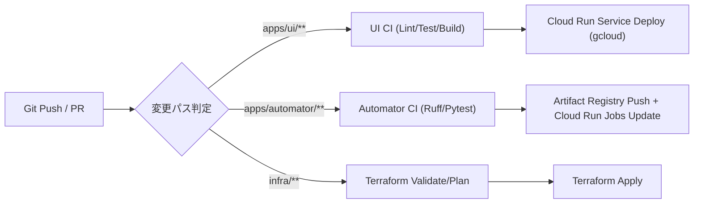

# SparkCast システムアーキテクチャ

本ドキュメントでは、ポッドキャスト配信・収録・編集・プロモーション支援システム「SparkCast」のシステム全体像、論理・物理アーキテクチャ、コンポーネント構成、およびインフラ基盤について解説します。

> [!NOTE]
> 関連ドキュメント：
> - [データベース・ストレージスキーマ](file:///Users/onotakayoshi/Documents/Projects/sunabalog/SparkCast/sparkcast/docs/database_and_storage_schema.md)
> - [処理パイプライン詳細](file:///Users/onotakayoshi/Documents/Projects/sunabalog/SparkCast/sparkcast/docs/processing_pipelines.md)
> - [サービスコンセプト・アピールポイント・AIエージェント](file:///Users/onotakayoshi/Documents/Projects/sunabalog/SparkCast/sparkcast/docs/service_concept.md)

---

## 1. システム全体像とアーキテクチャ概要

SparkCast は、**「ブラウザでの通話・収録から、AIによる文字起こし・要約・ファクトチェック・音声編集、RSS/SNS配信、過去回のRAG検索まで」** を一気通貫で自動化・支援するモノレポシステムです。

Next.js で構築されたフロントエンド兼管理API（`apps/ui`）と、Google Cloud / Cloudflare / 外部APIを連携させた Python バッチ群（`apps/automator`）による**イベント駆動型・疎結合ハイブリッドアーキテクチャ**を採用しています。

### 1.1 論理構成・データフロー図 (Mermaid)

```mermaid
flowchart TD
    %% ユーザーとUI
    User["ポッドキャスター / 出演者 (ブラウザ)"] <-->|通話 / 録音 / 管理操作| UI["Next.js UI (podcast-ui)"]
    UI -->|認証| Auth["Firebase Authentication"]

    %% ブラウザ収録ルーム基盤
    subgraph RecordingRoom ["ブラウザ収録ルーム (WebRTC / Edge)"]
        CF_SFU["Cloudflare Realtime SFU"] <-->|低遅延グループ通話 (Opus)| User
        CF_Worker["Cloudflare Worker + Durable Object"] <-->|在室・シグナリング・録音台帳| UI
        User -->|ローカル録音チャンク送信| CF_Worker
        CF_Worker -->|録音WebM保存| R2_Recordings[("Cloudflare R2 (recordings)")]
    end

    %% データストア
    UI <-->|管理データ (SQL)| DB[("PostgreSQL (Cloud SQL / Supabase)")]
    UI <-->|拡張メタ / 議事録 / ベクトル| FS[("Firestore (NoSQL)")]
    UI -->|署名付きURL発行| GCS_Input["GCS Input Bucket"]
    User -->|単一音声ファイル直接アップロード (PUT)| GCS_Input

    %% 収録確定トリガー
    UI -->|Cloud Run Jobs API (env override)| RunJob_Mixer["Cloud Run Job: mixer"]
    R2_Recordings -->|チャンク取得| RunJob_Mixer
    RunJob_Mixer -->|音量相関・ドリフト補正FLAC| GCS_Input
    RunJob_Mixer -->|話者別FLACトラック| GCS_Work["GCS Work Bucket (transcribe)"]

    %% 音声アップロードトリガーのパイプライン
    GCS_Input -->|オブジェクト確定 (Finalize)| Eventarc["Eventarc Trigger"]
    Eventarc --> Workflows["Cloud Workflows"]
    Workflows -->|ジョブ起動 (GCSパス引数)| RunJob_App["Cloud Run Job: app (音声処理)"]

    %% 音声処理ジョブの入出力
    RunJob_App <-->|ステータス更新| DB
    RunJob_App -->|変換後音声 (MP3) & RSS| R2_Public[("Cloudflare R2 (配信/feed.xml)")]
    RunJob_App -->|文字起こし / 拡張メタ / SNS案| FS
    RunJob_App <-->|音声認識 (BatchRecognize long)| STT["Speech-to-Text v2 (ja-JP)"]
    RunJob_App <-->|要約 / 議事録 / 推定| Gemini["Vertex AI / Gemini API"]
    RunJob_App <-->|高速型付き監査 (Score/Choice/Noul)| Jev["TypeSafe AI (Jev API)"]
    RunJob_App -->|完了通知 / 訂正承認要請| Discord_Notice["Discord (通知・Webhook)"]

    %% AIディレクター音声編集 (承認後)
    UI -->|訂正承認・編集実行| TTS["Cloud Text-to-Speech (Neural2)"]

    %% アジェンダ生成パイプライン
    Scheduler_Agenda["Cloud Scheduler (週次)"] -->|起動| RunJob_Agenda["Cloud Run Job: agenda"]
    RunJob_Agenda <-->|過去の会話ログ取得| Discord_Transcript["Discord (文字起こしch)"]
    RunJob_Agenda -->|ニュース取得| RSS_News["外部テックニュース (RSS)"]
    RunJob_Agenda <-->|アジェンダ提案保存| FS
    RunJob_Agenda -->|関連ニュースマッチング| Gemini
    RunJob_Agenda -->|アジェンダ投稿| Discord_Agenda["Discord (通知・Webhook)"]

    %% SNSプロモーションパイプライン
    Scheduler_Promo["Cloud Scheduler (定期)"] -->|起動| RunJob_Promo["Cloud Run Job: promoter"]
    RunJob_Promo <-->|予約データ取得 & 状態更新| FS
    RunJob_Promo -->|自動ポスト| X_API["X (旧Twitter) API"]

    %% 多ソースRAGチャット
    UI <-->|議事録検索 (Vector) / 全ソース注入| FS
    UI <-->|RAG回答生成 / 埋め込み| Gemini
    RunJob_App -.->|完了時即時再インデックス| UI
    Scheduler_Reindex["Cloud Scheduler (日次04:00 JST)"] -->|差分再インデックス| UI
```

### 1.2 アーキテクチャの基本原則

1. **ハイブリッドデータベース構成（PostgreSQL + Firestore）**
   - トランザクション一貫性・リレーション整合性が必要な基幹マスタ（ユーザー、番組、権限、エピソード基本情報、収録セッション）は **PostgreSQL (Cloud SQL / Supabase)** で正規化管理。
   - サイズが大きく時系列で追加される非構造化・半構造化データ（話者・時刻付き文字起こし断片、AI生成メタ、SNS投稿案、AIディレクター介入提案、アジェンダ提案、RAG埋め込みベクトル）は **Firestore (NoSQL)** で管理。
2. **GCS ID契約と疎結合連携**
   - Web UI と Python バッチ群はコードを共有せず、GCS のオブジェクトパス契約 `podcasts/{podcast_id}/episodes/{episode_id}/source/{filename}` および PostgreSQL/Firestore の共通キー（`podcast_id`, `episode_id`）を通じて完全に疎結合で連携。
3. **サーバーレス＆イベント駆動運用**
   - 音声アップロード時は GCS Finalize イベントから Eventarc → Cloud Workflows → Cloud Run Job を起動。
   - 収録セッション確定時は Cloud Run Jobs API を直接トリガー。
   - アジェンダ生成やSNS投稿、バックアップは Cloud Scheduler で必要時にのみ起動。常時稼働インスタンスを最小化し、インフラコストを最適化。
4. **エッジ＆ブラウザを活用した低コスト高品質収録**
   - グループ通話は Cloudflare Realtime SFU で安価に中継し、録音は参加者のブラウザ（MediaRecorder WebM/Opus）で行うことで、サーバー録音費用をゼロにしつつ通話品質劣化の影響を受けない高音質を実現。

---

## 2. 各層別のコンポーネント構成

本システムは以下の5つの機能層で構成されています。

### 2.1 UI / フロントエンド層（`apps/ui`）

Next.js 16 (App Router) / React 19 / TypeScript で構築された Web 管理フロントエンド。

| 画面 / コンポーネント | 役割・機能概要 |
|:---|:---|
| **エピソード一覧・詳細** | エピソードごとの処理ステータス確認、ショーノート、配信URLの確認・再生。 |
| **ブラウザ収録ルーム (`/record`)** | WebRTC 通話、各参加者のマイク録音、ホスト側予備録音、入室締め切り、ミュート/音量監視、テキストチャット。 |
| **エピソードエディタ** | 音声ファイルの手動アップロード、AI生成タイトル・概要文の手動編集、話者別文字起こしの確認。 |
| **AIディレクター承認パネル** | Jev が検出した重大な事実誤認（Score >= 3）に対する Gemini 訂正案の確認・編集・承認・却下。 |
| **SNS投稿管理 (`/sns`)** | AIが生成した複数プラットフォーム向け投稿案のスケジュール確認・編集・削除。 |
| **アジェンダ閲覧 (`/agenda`)** | 週次バッチが生成した次回トピック案・関連テックニュースの確認。 |
| **ナレッジRAGチャットウィジェット** | 過去の全配信エピソード・次回アジェンダ・SNS投稿を知識源とした自然言語チャット。 |
| **管理者パネル (`/admin`)** | ユーザー承認、事前登録メールアドレス管理、API利用量監査。 |

### 2.2 Web API / アプリケーション層（`apps/ui`）

Cloud Run Service 上で動作する Next.js のサーバーサイドAPI。

- **認証 & ゲートキーパー**: Firebase Authentication によるGoogleログイン、事前登録メール照合、管理者承認判定、API利用レート制限。
- **GCS署名付きURL発行**: クライアントからGCSへ最大 500MiB の大容量音声を直接PUTするための V4 署名付きURLを生成。
- **収録ルーム管理 & JWT発行**: Cloudflare Worker と連携するための `room JWT`（参加者用）および `service JWT`（管理API用）の発行、セッション作成・終了・確定。
- **ミキシングジョブ起動**: 収録完了時に Cloud Run Jobs API（`roles/run.jobsExecutorWithOverrides`）を呼び出し、`mixer` ジョブを起動。
- **AIディレクター編集トリガー**: 承認済み訂正案を音声編集パイプライン（`AUDIO_EDITOR_URL`）へ連携し、エピソードステータスを `editing` に遷移。
- **多ソースRAGチャットAPI**: 議事録・アジェンダ・SNS投稿をコンテキストに統合し、Gemini による回答を SSE（Server-Sent Events）でストリーミング配信。
- **再インデックスAPI (`/api/cron/reindex-minutes`)**: 議事録テキストのコンテンツハッシュを検証し、更新差分のみ Vertex AI 埋め込みモデルでベクトル化して Firestore に同期。

### 2.3 バッチ / バックエンド処理層（`apps/automator`）

Python 3.12 / uv で構築され、Cloud Run Jobs 上で実行されるコンテナバッチ群。

| ジョブ名 | エントリポイント | 起動トリガー | 主な責務 |
|:---|:---|:---|:---|
| **`app` (メイン)** | `main.py` | Workflows (GCS Finalize) | 音声のMP3変換、Speech-to-Text v2文字起こし、Gemini要約・議事録作成、Jevファクトチェック監査、R2公開、RSS更新、Discord通知。 |
| **`mixer` (収録ミキサー)** | `mixer_main.py` | Cloud Run Jobs API (UI確定) | R2の録音チャンク取得、相互相関による時間軸・ドリフト補正、FLACミックス音声生成、話者別トラック生成、GCSへの配置。 |
| **`agenda` (アジェンダ生成)** | `agenda_main.py` | Cloud Scheduler (毎週水曜 07:00 JST) | Discord文字起こしログ取得、テックニュースRSS取得、Gemini Groundingによるマッチング、次回テーマ提案、Discord投稿。 |
| **`promoter` (SNS投稿)** | `promoter_main.py` | Cloud Scheduler (定期実行) | Firestoreの `pending` 投稿取得、公開期限判定、X API（OAuth 1.0a）による自動ポスト、ステータス更新。 |
| **`backup` (DBバックアップ)** | `backup_main.py` | Cloud Scheduler (日次) | PostgreSQL の `pg_dump` 実行、圧縮、GCSバックアップバケットへの保存。 |

### 2.4 データ / ストレージ層

| ストレージ | 用途・格納データ | 特徴 |
|:---|:---|:---|
| **PostgreSQL** (Cloud SQL / Supabase) | ユーザー、番組、権限、エピソード基本情報、収録セッション、参加者、トラック情報。 | リレーショナル構造、外部キー整合性、トランザクション保証。Supabase Session Pooler (IPv4) 対応。 |
| **Firestore (NoSQL)** | エピソード拡張メタ、話者・時刻付き文字起こし断片、AIディレクター介入提案、SNS投稿案、次回アジェンダ、RAGベクトルインデックス。 | スキーマレス、サブコレクション階層、ベクトル検索（KNN `findNearest`）対応。 |
| **Google Cloud Storage** | 音声の直接アップロード領域（Input Bucket）、音声認識用の一時作業領域（Work Bucket）。 | 署名付きURL対応、ライフサイクルによる自動削除（7〜30日）。 |
| **Cloudflare R2** | 公開用MP3音声、RSSフィードファイル（`feed.xml`）、ブラウザ収録のWebMチャンク一時領域。 | S3互換API、エグレス転送量完全無料、カスタムドメイン配信。 |

### 2.5 エッジ・リアルタイム通話層（`apps/realtime`）

- **Cloudflare Realtime SFU**: 各参加者間の WebRTC 音声ストリームを中継。月 1TB までの転送量が無料で、分単位の固定費・従量課金を大幅に削減。
- **Cloudflare Workers + Durable Object**:
  - ルームごとに 1 つの Durable Object（SQLite内蔵、WebSocket Hibernation API）を割り当て。
  - 参加者の入退室管理、SFU トラックのシグナリング、ping/pong による時刻同期、テキストチャット（直近100件）、録音チャンク台帳を管理。
  - 録音チャンク（WebM/Opus）を R2 へ直接書き込み。

### 2.6 AI / ML 連携層

| サービス / モデル | 用途・役割 |
|:---|:---|
| **Google Cloud Speech-to-Text v2** (`long` モデル, ja-JP) | 東京リージョンでの高精度音声認識。単語・発話ごとの正確なタイムスタンプ取得。ダイナミックバッチ（1分 $0.003）による大幅なコスト削減。 |
| **Vertex AI / Gemini API** (`gemini-2.5-flash` / `gemini-2.0-flash-001`) | 文字起こしテキストからの要点録（`minutes`）・要約・タイトル生成、話者推定、SNS告知文起草、アジェンダ生成時のニューススコアリング、RAGチャット回答生成。 |
| **Vertex AI 埋め込みモデル** (`text-multilingual-embedding-002`) | 日本語対応 768 次元ベクトル生成。議事録のベクトル検索用インデックス構築。 |
| **TypeSafe AI (Jev API)** (`typesafe_sdk`) | 発話チャンクに対する Noul (事実性), Score (深刻度1〜5), Choice (誤認カテゴリ) の超高速型付きファクトチェック並行監査。 |
| **Google Cloud Text-to-Speech** (`ja-JP-Neural2-B` 等) | AIディレクターによる訂正スクリプトの自然な音声合成（カットイン用MP3生成）。 |

---

## 3. インフラストラクチャとデプロイ基盤

すべてのクラウドインフラは Terraform（`infra/`）によってコード化（IaC）され、GitHub Actions により自動プロビジョニングされます。

### 3.1 デプロイ環境の分離

- **`dev` 環境**: GCP プロジェクト `sunabalog-dev`。`develop` ブランチへのプッシュで自動デプロイ。
- **`prod` 環境**: GCP プロジェクト `sunabalog-prod`。`main` ブランチへのマージで自動デプロイ。

### 3.2 CI/CD パイプライン

`.github/workflows/` において、パスフィルタによりコンポーネントごとに独立して検証・デプロイされます。

```mermaid
flowchart LR
    Push["Git Push / PR"] --> Filter{"変更パス判定"}
    Filter -->|"apps/ui/**"| CI_UI["UI CI (Lint/Test/Build)"]
    Filter -->|"apps/automator/**"| CI_Auto["Automator CI (Ruff/Pytest)"]
    Filter -->|"infra/**"| CI_Infra["Terraform Validate/Plan"]

    CI_UI --> CD_UI["Cloud Run Service Deploy (gcloud)"]
    CI_Auto --> CD_Auto["Artifact Registry Push + Cloud Run Jobs Update"]
    CI_Infra --> CD_Infra["Terraform Apply"]
```
